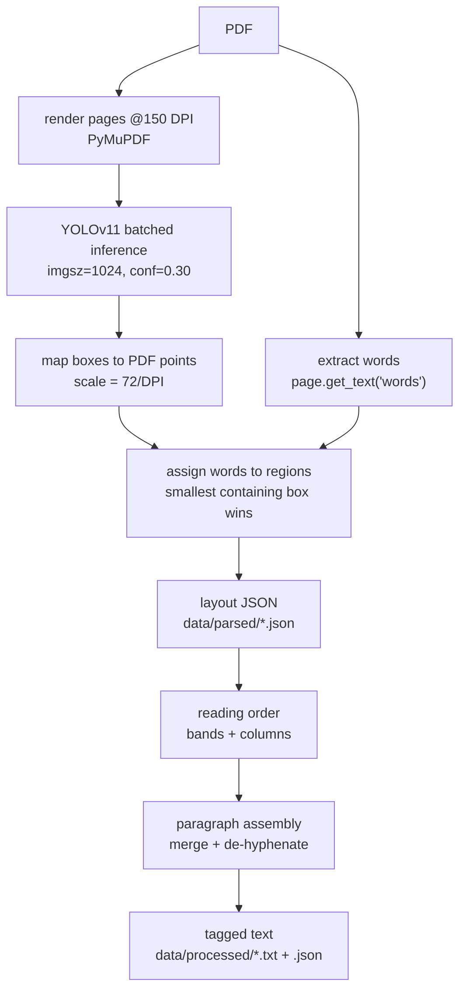

# Anneal — Parsing: layout detection, the assembler, and the model

> **Paths.** Code paths are relative to `app/`; the virtualenv and `tests/` sit
> at the repository root. Everything the app *writes* lives outside the
> repository, in the data home — `~/.local/share/anneal/`, or `$ANNEAL_HOME` if
> set — so `data/raw_pdfs/`, `vector_db/`, `models/`, `registry/` and `run/`
> below all mean `<data home>/…`.

How a PDF becomes structured text, in two stages: **stage 1** decides *where*
things are on a page; **stage 2**, the assembler, decides *what order they are
read in and where one thought ends*. This replaces the former
`parse_manager.md`, `AssemblerLogic.md` and `yolo_finetuning.md`.

The assembler is the highest-value piece of the pipeline, on the evidence of
[../../evals/Reports/Report.md](../../evals/Reports/Report.md): feeding **Docling's**
layout through it cut Docling's own mid-sentence paragraph rate from 17.4% to
2.9% (5 papers, `evals/Reports/parser_quality.json`). It is parser-agnostic —
it improves any layout detector's output, including ones we did not write.

```
PDF ──▶ stage 1: layout detection ──▶ layout JSON ──▶ ASSEMBLER ──▶ blocks JSON ──▶ chunker
        (YOLOv11 / Docling)                                       + tagged .txt
```

1. [Why layout detection](#1-why-layout-detection)
2. [Inference runs on onnxruntime, not ultralytics](#2-inference-runs-on-onnxruntime-not-ultralytics)
3. [Stage 1 — PDF to layout JSON](#3-stage-1--pdf-to-layout-json)
4. [Stage 2 — the assembler](#4-stage-2--the-assembler)
5. [Service loop](#5-service-loop--mainpy)
6. [Alternative backend — Docling](#6-alternative-backend--docling)
7. [Tuning knobs](#7-tuning-knobs-configpy)
8. [Files](#8-files)
9. [Fine-tuning the layout model](#9-fine-tuning-the-layout-model)

---

## 1. Why layout detection

Plain text extraction (PyMuPDF blocks + spacing heuristics) could not answer
questions that determine chunk quality:

- Are two pieces of text part of the same paragraph?
- Is a piece of text body text, or text drawn *inside* a figure?
- When text continues on the next page, is the first line a page header or a
  paragraph continuation?
- Which column does a block belong to, and in what order should columns be
  read?

A fine-tuned **YOLOv11 document-layout model** answers these visually:
each page is rendered to an image and every region is detected with a class
and bounding box. Heuristics then only have to *order and join* regions, not
guess what they are.

**Model**: first existing candidate wins (`MODEL_CANDIDATES` in `config.py`),
each loaded from its **`.onnx`** export next to the `.pt`:

1. `models/yolo11s_doc_layout_imgsz_1024/weights/best.onnx` — fine-tuned small (preferred)
2. `models/yolo11_doc_layout_v2224_imgsz_1024/weights/best.onnx` — 1st fallback
3. `models/yolo11n_doc_layout_imgsz_1024/weights/best.onnx` — last fallback

All were fine-tuned at imgsz 1024 from `Armaggheddon/yolo11-document-layout`
on annotated research papers. Classes:

```
Caption, Footnote, Formula, List-item, Page-footer, Page-header,
Picture, Section-header, Table, Text, Title, Authors
```

## 2. Inference runs on onnxruntime, not ultralytics

`ultralytics` is **not a runtime dependency** — it is AGPL-3.0, and importing
it in shipped software would impose copyleft on the whole product
([PENDING_IMPROVEMENTS.md](PENDING_IMPROVEMENTS.md) item 4). Instead:

- `scripts/export_onnx.py` converts each `best.pt` to `best.onnx` **once, at
  build time**. Running ultralytics privately to produce a file is not
  distribution, so the AGPL places no restriction on it.
- `onnx_detector.py` loads the `.onnx` with **onnxruntime** (MIT) and does
  preprocessing, decoding and NMS in numpy. Class names, `imgsz` and `stride`
  travel inside the ONNX metadata, so a `.onnx` file is self-describing.
- `layout_detector.py` refuses to start if only a `.pt` is present, telling
  you to run the export.

**This was verified as an exact behavioural swap**, not an approximation:
across 3 papers / 30 pages, **407 of 407 regions matched** the ultralytics
output at IoU > 0.995 (mean IoU 0.9999), with zero extra or missing boxes and
a maximum confidence difference of 0.00005. Three details had to match
exactly to get there, each of which silently shifted results when wrong:

| Detail | Wrong version | Effect |
|---|---|---|
| Resampler | Pillow BILINEAR (antialiases when downscaling) | confidences moved up to 0.35 — enough to drop a real region below `YOLO_CONF` |
| Padding | full 1024 square | ultralytics pads only to the next stride multiple when a batch is uniformly shaped, so a page runs at 1024x800 and the model sees different context |
| Inverse transform | float half-difference | boxes off by half a pixel; small regions (page footers) fell to IoU 0.94 |

**Batch shape must stay constant.** The CUDA provider re-tunes its
convolution algorithms for every new input shape, so a short final batch
costs more than the pages it saves — measured 4.2 pages/s with varying
shapes versus 17 pages/s with a fixed batch. `predict(fixed_batch=…)` pads a
short tail batch by repeating its last page and discards the extra results.

Speed is unchanged by the migration: **10–14 pages/s** end to end on the
GTX 1650, the same as the ultralytics path. GPU use needs `onnxruntime-gpu`
plus CUDA 12.x / cuDNN 9.x; when those come from the `nvidia-*-cu12` wheels
rather than a system install, `onnx_detector.py` preloads them so the CUDA
provider can resolve them (otherwise it silently falls back to CPU, ~2
pages/s).

## 3. Stage 1 — PDF to layout JSON



### The steps

1. **Render** each page at 150 DPI with PyMuPDF (no poppler dependency).
2. **Detect** regions with YOLO in batches of 4 pages (fits the 4GB GPU;
   automatic CPU fallback if GPU inference fails — see `layout_detector.py`).
   A short final batch is padded so the input shape never changes.
3. **Map** pixel boxes back to PDF points so they can be intersected with
   PyMuPDF's word coordinates.
4. **Assign words to regions**: each word goes to the *smallest* detected
   region containing its center — so a Caption lying on top of a Picture
   claims its own words.
   - Words inside `Picture` / `Page-header` / `Page-footer` boxes and in no
     smaller region are **swallowed**: recorded in the JSON but excluded from
     the text flow. This is what removes figure-internal text and running
     headers.
   - Words covered by **no** detection are grouped (by PyMuPDF block) into
     fallback `Text` regions with `conf: 0.0`, so model misses never lose
     content.
5. **Column splitting** (`split_region_columns`): a region at least half the
   page wide is checked for **gutters** — x-intervals that *no* word in the
   region crosses, about a line-height wide, with words on both sides on two
   or more text rows. Such a region is split into one region per column
   before lines are built. Both conditions matter: running prose always has
   some line covering any given x, and the row test rejects the one-off wide
   space of a centred heading. The threshold scales with the region's own
   font (word spaces run ~2.5pt where real gutters run ~12pt), so it is not
   a tuned constant.

   This fixes two real cases the layout model produces:
   - a **3-across `Authors` block** detected as one box, which would
     otherwise read "Alice Bob Carol Univ A Univ B Univ C";
   - a **mid-page column merge**, where a two-column stretch is detected as
     one wide `Text` box and its lines would be stitched together across the
     gutter.

   Splitting applies only to `SPLITTABLE_LABELS` — an **allowlist**
   (`Text`, `Authors`, `List-item`, `Caption`, `Footnote`), so a label that
   is new or was never considered defaults to *not* being split:

   | Excluded | Why |
   |---|---|
   | `Table`, `Formula` | their columns belong to their *rows*; splitting on a gutter separates row labels from their values (this was a real bug — a table came out as just its row labels) |
   | `Picture` | read as one unit; its text is swallowed anyway |
   | `Title`, `Section-header` | a heading is one logical unit, so a split can only ever turn one heading into two |
   | `Page-header`, `Page-footer` | dropped before assembly, so splitting has no effect on output |

   **All four conditions must hold**, which is why it is nearly inert:

   1. the label is in the allowlist;
   2. the region is at least **half the page wide** (a normal body column in
      a two-column paper cannot be, so it is excluded outright);
   3. a gutter crosses the *whole* region, at least ~one line-height wide,
      with words on both sides on **3 or more rows** (two rows align by
      coincidence too easily);
   4. every resulting column is at least **15% of the region width** — a
      pseudocode line-number margin is ~3%, and splitting there would strip
      the numbers off their statements.

   Measured over the whole corpus — **46 PDFs x 8 pages, 4,430 regions with
   words** — the funnel is:

   | Stage | Regions |
   |---|---|
   | have words | 4,430 |
   | blocked: label not splittable | 1,157 |
   | blocked: narrower than half the page | 1,996 |
   | passed both gates | 1,277 |
   | of those, no qualifying gutter | 1,276 |
   | **actually split** | **1** |

   So the realistic answer to "how often per PDF" is **zero for 45 of 46
   papers, and once for the one with a 3-across author block**.

   **Known residual risk**: a definition list (term | meaning) that the model
   labels `Text` rather than `Table` will be split, separating terms from
   their meanings — the same damage shape as the table case, under a label
   that has to stay splittable. Not observed in the corpus; if it appears,
   the fix is upstream (the model should call it a `Table`).

   Split parts are marked `column_split: true` in the JSON.
6. **Line building**: each region's words are clustered into lines by
   y-center (tolerance = 0.6 × median word height) and sorted left-to-right.

Output (`data/parsed/<name>.json`): per page, `width`/`height`, regions with
`label`, `conf`, `bbox`, `lines`, plus `swallowed_text`.

## 4. Stage 2 — the assembler

Stage 1 decides *where* things are; the assembler decides *what order they
are read in and where one thought ends*. `parse_manager/txt_processor.py`.

### 4.1 Input format

The assembler consumes a **layout JSON**: one entry per page, each holding
labelled regions with pixel geometry and the words that fall inside them.

```jsonc
{
  "source_pdf": "…/2609.10065.pdf",
  "backend": "yolo",              // or "docling"
  "num_pages": 8,                 // pages the parser actually read
  "pdf_pages": 8,                 // pages the document has (coverage check)
  "pages": [
    {
      "page": 0,                  // zero-based
      "width": 612.0,             // PDF points, used for column geometry
      "height": 792.0,
      "regions": [
        {
          "label": "Text",        // one of the twelve classes below
          "conf": 0.94,
          "bbox": [72.0, 310.4, 300.1, 480.9],   // x0, y0, x1, y1, top-left origin
          "lines": ["First line of the region,", "second line contin-"]
        }
      ],
      "swallowed_text": [         // words dropped inside Picture/header/footer
        {"label": "Picture", "text": "Fig. 2 axis label"}
      ]
    }
  ]
}
```

#### The twelve classes

| Label | Assembler treatment |
|---|---|
| `Title` | own block, forces a paragraph break |
| `Authors` | own block, forces a break, **excluded from embedding** |
| `Section-header` | own block, forces a break |
| `Text` | body prose, participates in paragraph merging |
| `List-item` | consecutive items accumulate into one list block |
| `Caption` | own block, does **not** break an open paragraph |
| `Table` | own block, lines preserved verbatim |
| `Formula` | own block, does **not** break an open paragraph |
| `Footnote` | own block, **excluded from embedding** |
| `Picture` | anchor only, contributes no text |
| `Page-header` | dropped from the flow, kept as metadata |
| `Page-footer` | dropped from the flow, kept as metadata |

#### Two contracts the input must honour

**Geometry is top-left origin, in PDF points.** `bbox` is `[x0, y0, x1, y1]`
with `y` increasing downward, and `width` must be the page width in the same
units. Column detection is pure geometry, so a bottom-left origin silently
inverts reading order.

**`lines` are visual lines, not paragraphs.** The assembler expects the region
split at the line breaks the PDF actually has, because de-hyphenation works on
line ends. A region handed one pre-joined string still works, but wrap hyphens
inside it will never be repaired.

`swallowed_text` is optional and informational. Stage 1 already excluded those
words; the assembler only copies them into the output as evidence of what was
discarded.

---

### 4.2 The logic

#### Reading order — `order_regions`

Runs per page, before anything is read.

1. **Drop the furniture.** `Page-header` and `Page-footer` regions leave the
   flow immediately.
2. **Decide single- or two-column.** If at least `SINGLE_COLUMN_FRACTION`
   (0.7) of the regions that contain text are wider than
   `FULL_WIDTH_FRACTION` (0.6) of the page, the page is single-column and is
   read top-to-bottom, left-to-right. Done.
3. **Otherwise band the page.** A region is a **separator** if it is
   full-width, or if it is labelled `Authors`. Separators interrupt the column
   flow: everything accumulated above them is emitted as a two-column band
   first, then the separator, then accumulation resumes below.
4. **Within a band**, regions whose horizontal centre is left of the page
   midline are read top-to-bottom, then the right column top-to-bottom.
5. **Runs of separators that overlap vertically** are read left-to-right
   rather than top-to-bottom. This is the three-across author block: three
   narrow boxes on one row that would otherwise be read as a column.

The `Authors` special case earns its place: those boxes sit in the title band
and are narrow, so without naming them explicitly they would be sorted into a
body column and appear in the middle of the abstract.

#### Line joining and de-hyphenation — `join_lines`, `join_hyphenated`

A region's lines are joined with single spaces, except where a line ends in a
hyphen. Then:

- Continuation starts **uppercase** → keep the hyphen. `non-` + `Euclidean` →
  `non-Euclidean`.
- Continuation starts **lowercase** → drop it. `construc-` + `tion` →
  `construction`.
- **Unless the compound exists intact elsewhere in the document.** Before
  assembling, `collect_hyphenated_vocab` scans every line for hyphenated
  compounds appearing mid-line and lower-cases them into a set. If
  `edge-centric` appears intact anywhere, then `Edge-` + `centric` keeps its
  hyphen.

That vocabulary pass is what stops the de-hyphenator destroying real compound
terms, which in a technical corpus are common and load-bearing.

#### Paragraph reconstruction — `LayoutAssembler`

This is the core, and the part that produced the 17.4% → 2.9% improvement.

The assembler keeps **one open paragraph buffer** and walks regions in reading
order. A paragraph stays open across region, column and page boundaries. It
closes when either:

- its text **ends terminally** — `.`, `!` or `?`, optionally followed by a
  closing quote or bracket — and a new `Text` region arrives; or
- a `Title`, `Section-header` or `Authors` region forces a flush.

Everything else leaves it open. A `Caption`, `Formula`, `Footnote` or `Table`
appearing mid-paragraph is emitted as its own block **without closing the
buffer**, so a sentence interrupted by a figure caption is rejoined afterwards:

```
…the interplay between recombination and                 ← region ends, no full stop
[CAPTION] Fig. 1: The process of alert life-cycle…       ← emitted, buffer stays open
hydrodynamical instabilities has received…               ← merged into the same paragraph
```

The block records the page where the paragraph **started**, not where it ended.

`List-item` regions have their own rule: consecutive ones accumulate into a
single `list` block joined by newlines, and any other region type closes it.

#### What never reaches the output

- `Page-header`, `Page-footer` — collected into `dropped.page_headers` /
  `dropped.page_footers`
- text inside `Picture` boxes — collected into `dropped.picture_text` from
  stage 1's `swallowed_text`
- `Picture` regions themselves contribute nothing; they exist only as reading-
  order anchors

Note that `Authors` and `Footnote` blocks **are** emitted here. They are
excluded later, by the chunker's `SKIP_TYPES`, not by the assembler.

---

### 4.3 Output

Two files per document.

#### `data/processed/<stem>.json` — what the chunker consumes

```jsonc
{
  "source": "…/2609.10065.pdf",
  "num_pages": 8,
  "pdf_pages": 8,
  "dropped": {
    "page_headers": ["Cost-Aware Vision-Language Model Arbitration"],
    "page_footers": [],
    "picture_text": ["Fig. 2 axis label", "…"]
  },
  "blocks": [
    {"type": "title",     "page": 0, "text": "Cost-Aware Vision–Language…"},
    {"type": "authors",   "page": 0, "text": "A. Author, B. Author"},
    {"type": "section",   "page": 0, "text": "1 Introduction"},
    {"type": "paragraph", "page": 0, "text": "Cloud systems, such as…"},
    {"type": "caption",   "page": 3, "text": "Table 1: Results by dataset."},
    {"type": "table",     "page": 3, "text": "Cora 91.6\nCiteseer 92.2"}
  ]
}
```

Block types are lower-case and fewer than the input labels: `title`,
`authors`, `section`, `paragraph`, `list`, `caption`, `table`, `formula`,
`footnote`. Blocks with empty text are dropped.

`pdf_pages` alongside `num_pages` is what makes a truncated parse detectable
later — see `common/coverage.py`.

#### `data/processed/<stem>.txt` — for humans

The same blocks rendered with tags, for reading and for
`scripts/rag_inspect.py`:

```
# Cost-Aware Vision–Language Model Arbitration

[AUTHORS] A. Author, B. Author

## 1 Introduction

Cloud systems, such as Microsoft Azure…

[CAPTION] Table 1: Results by dataset.

[TABLE]
Cora 91.6
Citeseer 92.2
[/TABLE]
```

This file is **not** what gets embedded. The chunker reads the JSON. The `.txt`
tags and the chunker's `~~~table` fences are different conventions serving
different readers.

---

## 5. Service loop — `main.py`

Two daemon threads poll the registry every 5s:

| Loop | Acts on status | Produces | New status |
|---|---|---|---|
| parser | `downloaded` | `data/parsed/*.json` | `parsed` |
| processor | `parsed` | `data/processed/*.{txt,json}` | `processed` |

A stage that raises records `error` with the message (the paper is then
skipped until `scripts/register_pdfs.py --retry-errors`).

## 6. Alternative backend — Docling

`PARSER_BACKEND = "docling"` swaps stage 1 for IBM Docling
(`docling_backend.py`), which maps its output onto the same layout JSON so
stage 2 runs unchanged. Docling brings **TableFormer**, which reconstructs
table structure instead of grouping words into lines.

Measured on this machine (GTX 1650, two papers, 10 pages each, **both
backends warmed first so model-load time is excluded**, and both compared as
complete pipelines — the YOLO arm includes PyMuPDF rendering and word
extraction, and both feed the same stage 2):

| | PyMuPDF + YOLO (fine-tuned small) | Docling |
|---|---|---|
| Throughput | 15.9 and 10.4 pages/s (avg **13.1**) | 1.4 and 3.6 pages/s (avg **2.5**) |
| Peak VRAM | 883 MB | 913–1043 MB |
| Tables | word rows, no column structure | Markdown with headers and aligned cells |

Docling is **~5× slower** and uses ~150 MB more VRAM. Two measurement traps
are worth knowing, because both made Docling look far worse before they were
controlled for:

- **Model load dominates a cold run.** Uncorrected first runs showed 0.07
  pages/s — nearly all of it loading models. Always warm before timing.
- **OCR is on by default and runs on CPU.** arXiv PDFs are born-digital, so
  their text layer is already present and the OCR pass is pure overhead;
  `docling_backend.py` disables it (`DOCLING_OCR=1` re-enables it for scanned
  documents). This alone accounted for a 6× difference.

The pragmatic reading: keep YOLO as the default — a 46-paper ingest is
minutes either way, and 5× is not the 30× it first appeared — and reach for
Docling when a corpus is table-heavy. The same Table 1 comes out of Docling
as aligned Markdown with headers, versus a flat run of numbers from the
line-grouping path.

### 6.1 Reformatting Docling for this assembler

**`parse_manager/docling_backend.py`** is the adapter. It is the answer to
"the assembler is written for twelve YOLO classes, so how does it run on
Docling" — Docling's output is translated into that vocabulary before the
assembler sees anything.

Entry point:

```python
docling_backend.detect_pdf(pdf_path, max_pages=None)   # -> the same layout JSON
```

Enable it in production with `PARSER_BACKEND=docling`; `pdf_parser.parse()`
dispatches on it and everything downstream is unchanged.

What the adapter does:

1. **Translates labels** through `LABEL_MAP`, roughly twenty Docling labels
   onto our twelve. `section_header` → `Section-header`, `list_item` →
   `List-item`, `code` → `Text`, and so on; anything unrecognised falls back
   to `Text`.
2. **Flips the coordinate origin.** Docling boxes are bottom-left origin; ours
   are top-left. The adapter converts with `page_height - y`, which is
   essential because column detection is pure geometry.
3. **Extracts table structure** through TableFormer, exporting each table to
   markdown and splitting it into `lines`, rather than taking a flat text dump.
4. **Reads text from `.text`, falling back to `.orig`.** Docling leaves
   `.text` empty on formula items and puts the content in `.orig`. Reading
   only `.text` silently discarded every equation in the corpus — a bug that
   survived a full benchmark run before it was caught. See
   `evals/README.md`.
5. **Disables OCR** by default, since arXiv PDFs are born-digital and their
   text layer is already present. `DOCLING_OCR=1` re-enables it for scanned
   documents.

#### What the adapter cannot supply

Two of the twelve classes come back empty, and no mapping fixes it:

| Class | Why | Consequence |
|---|---|---|
| `Title` | Docling *has* the label, but its model classified titles as section headers on all 15 evaluation papers | the chunker's heading path falls back to the filename, so **100%** of Docling chunks are prefixed with the arXiv id instead of the paper title |
| `Authors` | Docling has no such concept | author names fall through as `Text` and get embedded as body prose |

Closing that gap does not need a fine-tuned model. Inferring the title from the
largest text block on page 1, and authors from the block between title and
abstract, would recover both — see the recommendation in
`evals/Reports/Report.md`.

## 7. Tuning knobs (`config.py`)

| Setting | Default | Meaning |
|---|---|---|
| `MODEL_CANDIDATES` | s → v2224 → n | layout weights, first existing wins |
| `PARSER_BACKEND` | `"yolo"` | `"docling"` to use Docling for stage 1 |
| `RENDER_DPI` | 150 | page raster resolution |
| `YOLO_IMGSZ` | 1024 | must match fine-tuning imgsz |
| `YOLO_CONF` | 0.30 | detection confidence threshold |
| `YOLO_IOU` | 0.70 | NMS IoU threshold (ultralytics' `predict` default, which is what the corpus was parsed with) |
| `YOLO_BATCH` | 4 | pages per batch (4GB GPU); also the fixed shape short batches are padded to |
| `FULL_WIDTH_FRACTION` | 0.6 | band-separator width threshold |
| `SINGLE_COLUMN_FRACTION` | 0.7 | single-column page detection |

Column splitting has no config knob: its gutter threshold is derived from
each region's own font size (see stage 1, step 5).

## 8. Files

| File | Role |
|---|---|
| **`parse_manager/txt_processor.py`** | **the assembler itself** — `order_regions`, `join_lines`, `join_hyphenated`, `collect_hyphenated_vocab`, `LayoutAssembler`, `render_txt`, `process_layout_json` |
| `parse_manager/config.py` | `FULL_WIDTH_FRACTION` (0.6), `SINGLE_COLUMN_FRACTION` (0.7), `SWALLOW_LABELS`, `PROCESSED_DIR` |
| `parse_manager/pdf_parser.py` | stage 1: renders pages, assigns words to regions, produces the layout JSON and `swallowed_text` |
| `parse_manager/layout_detector.py` | the YOLOv11 detector behind stage 1 |
| `parse_manager/onnx_detector.py` | ONNX Runtime inference: letterboxing, DFL decode, per-class NMS |
| `parse_manager/docling_backend.py` | the adapter that lets Docling feed this assembler (section 5) |
| `parse_manager/main.py` | the service loop that calls stage 1 then stage 2 |
| `embedding_manager/chunking.py` | the consumer — Grain-Growth chunking over these blocks |
| `common/coverage.py` | uses `num_pages` vs `pdf_pages` to detect a truncated parse |
| `tests/test_txt_processor.py` | unit tests for ordering, de-hyphenation and paragraph merging |
| `scripts/rag_inspect.py` | `parse` stage renders the `.txt` for inspection |

---

## 9. Fine-tuning the layout model

Commands used to fine-tune the document-layout model on annotated research
papers (dataset and runs live on the external training drive).

### Train

```bash
yolo detect train \
  data=/media/mudit/DarkDwine1/ResearchPapersYOLO_FT/training_dataset/round_final/data.yaml \
  model=/media/mudit/DarkDwine1/ResearchPapersYOLO_FT/models/base_model/yolo11n_doc_layout.pt \
  epochs=150 \
  imgsz=1024 \
  batch=5 \
  patience=45 \
  project=/media/mudit/DarkDwine1/ResearchPapersYOLO_FT/models \
  name=yolo11n_doc_layout_imgsz_1024
```

Base model: `Armaggheddon/yolo11-document-layout` (nano). The deployed run
(`yolo11n_doc_layout_imgsz_1024`) was trained at **imgsz 1024** — inference in
`parse_manager` must use the same size (`YOLO_IMGSZ` in
`parse_manager/config.py`). Classes include the standard DocLayNet 11 plus a
fine-tuned `Authors` class.

### Dataset housekeeping

```bash
# Segregate images and labels after annotation export
mv *.jpg *.png ../images/ 2>/dev/null
mv *.txt labels/
```

### Export to ONNX

```bash
yolo export \
  model=.../weights/best.pt \
  format=onnx dynamic=False opset=19
```

### Deploy

Copy the run directory into the repo (git-ignored):

```bash
cp -r /media/mudit/DarkDwine1/ResearchPapersYOLO_FT/models/yolo11n_doc_layout_imgsz_1024 models/
```

Then export it to ONNX, which is what the pipeline actually loads
(`parse_manager` never imports ultralytics at runtime — see
[PENDING_IMPROVEMENTS.md](PENDING_IMPROVEMENTS.md) item 4):

```bash
python scripts/export_onnx.py        # every model in MODEL_CANDIDATES
```

`parse_manager` then picks up `<dir>/weights/best.onnx` automatically, in the
`MODEL_CANDIDATES` order. The `.pt` files can stay for future retraining but
are not used at inference time.
