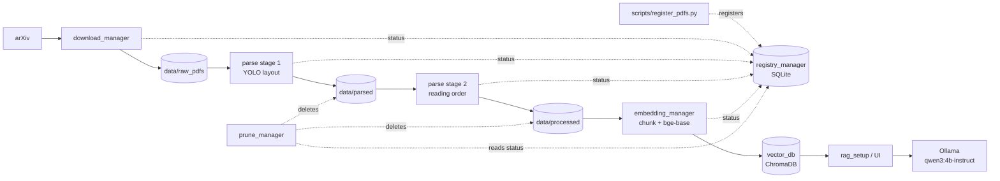

# System Walkthrough — how every piece fits together

This is the long-form companion to [architecture.md](architecture.md) (the
short overview) and to the multi-page diagram
[diagrams/system_architecture_detailed.drawio](../diagrams/system_architecture_detailed.drawio)
(page 1 = system, pages 2–8 = one per module). It answers, for every
module and every store: **what** it does, **why** it exists in that form,
**when** it runs (what triggers it), what it **reads and writes**, and
**what happens next**. File, function and config names are given so you can
follow along in the editor.

Contents

1. [The puzzle in one paragraph](#1-the-puzzle-in-one-paragraph)
2. [Every component at a glance](#2-every-component-at-a-glance)
3. [The state: databases, stores, directories](#3-the-state-databases-stores-directories)
4. [The coordination model: statuses and polling](#4-the-coordination-model-statuses-and-polling)
5. [Life of one paper, step by step](#5-life-of-one-paper-step-by-step)
6. [Life of one question, step by step](#6-life-of-one-question-step-by-step)
7. [The GPU: who uses it when](#7-the-gpu-who-uses-it-when)
8. [The operations layer](#8-the-operations-layer)
9. [Configuration map](#9-configuration-map)
10. [Data formats at every boundary](#10-data-formats-at-every-boundary)
11. [Failure behaviour and known gaps](#11-failure-behaviour-and-known-gaps)

---

## 1. The puzzle in one paragraph

Papers arrive as PDFs (from arXiv via the **downloader**, or copied by hand
and **registered**). Each PDF is turned into a faithful, structured text by
the **parser** — a fine-tuned YOLOv11 layout model decides *what* every
region of a page is, and heuristics decide *in what order* they are read
and *which pieces belong to the same paragraph*. The **embedder** cuts that
structured text into chunks that respect headings and paragraphs, embeds
them with `bge-base`, and stores vector + text + metadata in **ChromaDB**.
At question time, the **UI** (or CLI) embeds the question the same way,
pulls the closest chunks back, hands them to a local **Qwen** model running
under **Ollama** with a prompt that forbids using anything else, and streams
back an answer whose every claim cites a chunk. The whole ingestion side is
coordinated by one small **registry** service: a SQLite table with one row
per paper and a `status` column; every stage polls it to find work and
writes back when done. The **prune** service deletes intermediates once a
later stage has consumed them. A set of **scripts** starts, stops, resets
and inspects all of this.



Two design ideas explain almost everything else:

- **Status-driven, poll-based stages.** No stage calls the next one.
  Each stage is an independent process that periodically asks the registry
  "is there a paper at the status I consume?", does its work, and writes
  the next status. This is why stages can be started, stopped and restarted
  in any order, why a crash never loses work (the status simply hasn't
  advanced), and why adding papers to a running system is just a registry
  insert.
- **The PDF's filename stem is the key everywhere.** `A_Plan_Reuse_….pdf`
  → registry row `A_Plan_Reuse_…` → `parsed/A_Plan_Reuse_….json` →
  `processed/A_Plan_Reuse_….{txt,json}` → Chroma ids `A_Plan_Reuse_…_0…n`
  and metadata `filename`. Every stage derives the key from the file it is
  holding; nothing has to be looked up.

## 2. Every component at a glance

| Component | Kind | Port | Trigger | Reads | Writes | Next |
|---|---|---|---|---|---|---|
| `registry_manager` | FastAPI + SQLite | 4000 | HTTP calls from all others | `rag_registry.db` | `rag_registry.db` | — (everyone polls it) |
| `download_manager` | loop, 10 threads | — | manual start; every 3600 s | arXiv, registry checkpoint | `data/raw_pdfs/`, status `downloaded` | parse stage 1 |
| `scripts/register_pdfs.py` | one-shot | — | manual / `fresh_start.sh` | `data/raw_pdfs/` | status `downloaded` | parse stage 1 |
| `parse_manager` stage 1 (`pdf_parser.py`) | loop | — | every 5 s: status `downloaded` | PDF, YOLO weights | `data/parsed/*.json`, status `parsed` | stage 2 |
| `parse_manager` stage 2 (`txt_processor.py`) | loop (same process) | — | every 5 s: status `parsed` | `data/parsed/*.json` | `data/processed/*.{txt,json}`, status `processed` | embedder |
| `embedding_manager` ingest loop | loop | — | every 60 s: status `processed` | `data/processed/*.json`, bge-base | ChromaDB, status `embedded` | queryable |
| `embedding_manager` API | FastAPI | 4001 | a question | ChromaDB | — | rag.py |
| `rag_setup/rag.py` | library + CLI | — | UI request / CLI input | :4001, Ollama or Gemini | stdout / stream | user |
| `UI/` | FastAPI + HTML | 4002 | user in browser | rag.py, :4001, Ollama | ndjson stream | user |
| Ollama daemon | systemd service | 11434 | first chat request | model blobs | — | — |
| `prune_manager` | loop | — | every 1800 s | registry statuses | deletes `parsed/`, `processed/` | — |
| `scripts/*` | shell / python | — | you | see §8 | see §8 | — |

## 3. The state: databases, stores, directories

There are three databases/stores that hold *derived* state, one directory
that holds the *source of truth* (the PDFs), and two intermediate
directories.

### 3.1 Registry — `registry_manager/rag_registry.db` (SQLite)

One table, `file_status_table`, one row per paper, created by
`FileRegistry._init_db()` on every registry start (`CREATE TABLE IF NOT
EXISTS`, so an existing file is never altered — which is why the reset
script deletes the file instead of clearing rows):

| column | set by | meaning |
|---|---|---|
| `filename` (PK) | downloader / register_pdfs | the PDF stem — the universal key |
| `status` | every stage | `downloaded` → `parsed` → `processed` → `embedded` (`error` exists in the CHECK constraint but nothing sets it; see §11) |
| `domain`, `published_at` | downloader only | which arXiv search found it, when it was published — `published_at` is what the downloader's checkpoint (`get_last_domain_date`) is computed from |
| `downloaded_at`, `parsed_at`, `processed_at`, `embedded_at` | each stage's `update_status` | timestamps |
| `error_count`, `last_error` | (unused today) | — |

**Why a service and not a shared file?** Five independent processes write
to it. SQLite handles concurrent access from one process well and from
several badly; a single FastAPI owner serialises writes and gives the
others a trivial HTTP contract (`GET /get_status`, `POST /update_status`,
`POST /get_last_checkpoint`). The read-only scripts (`pipeline_status.py`,
`wait_for_ingestion.py`) open the SQLite file directly with `mode=ro`,
which is safe.

**Idempotency rules** (`FileRegistry.update_status`): `downloaded` is
`INSERT OR IGNORE`, so registering a known paper is a no-op; the other
statuses are plain `UPDATE`s that also stamp the matching `_at` column and
zero `error_count`.

### 3.2 Vector store — `vector_db/` (ChromaDB, persistent)

Collection `papers_bge_base_v1` (`COLLECTION_NAME` in
`embedding_manager/config.py`). Every record has:

- `id` — `"{stem}_{chunk_index}"`
- `document` — the text that was embedded: heading path line, blank line,
  chunk body
- embedding — 768-d normalized vector from `BAAI/bge-base-en-v1.5`;
  distance metric cosine, HNSW index
- `metadata` — `filename`, `title`, `section`, `page_start`, `page_end`
  (0-indexed), `block_types` (comma-joined), `chunk_index`, `n_chars`

Metadata is stored *beside* the vector and is never embedded. It is what
`where={"filename": {"$in": [...]}}` filters on, and it can be changed
with `collection.update()` without re-embedding.

**Why is the collection name tied to the model?** Vectors from different
models have different dimensions and are not comparable. Switching model
means a new collection and a re-ingestion, and the name makes that
impossible to get wrong silently.

### 3.3 Model stores

| what | where | who fetches it |
|---|---|---|
| YOLOv11 layout weights (fine-tuned small, nano; pretrained fallback) | `models/…/weights/best.pt`, `models/yolo11n_doc_layout.pt` | you (copied from the training drive) / `scripts/download_layout_model.py` |
| `bge-base-en-v1.5` | `~/.cache/huggingface/hub/models--BAAI--bge-base-en-v1.5` | sentence-transformers, automatically on first embedding-service start |
| `qwen3:4b-instruct` | `/usr/share/ollama/.ollama/models` (Ollama's own store) | `ollama pull` |

### 3.4 Directories

| directory | written by | consumed by | pruned |
|---|---|---|---|
| `data/raw_pdfs/` | downloader, you | parse stage 1 | **never** (unless `PRUNE_RAW_PDFS=True`) |
| `data/parsed/` | parse stage 1 | parse stage 2 | once status ∈ {processed, embedded} |
| `data/processed/` | parse stage 2 | embedder (`.json`), you (`.txt`) | once status = embedded |
| `run/logs/`, `run/pids/` | start scripts | you, `stop_services.sh`, `pipeline_status.py` | — |

## 4. The coordination model: statuses and polling

```
   (none) ──downloader / register_pdfs──▶ downloaded
 downloaded ──parse stage 1 (5 s poll)──▶ parsed
     parsed ──parse stage 2 (5 s poll)──▶ processed
  processed ──embedder (60 s poll)──────▶ embedded
```

Each loop is the same shape (`parse_manager/main.py`,
`embedding_manager/main.py`):

```
forever:
    for file in <the directory I consume>:
        if registry.get_status(stem) != <the status I consume>: continue
        do the work; write the output file
        registry.update_status(stem, <next status>)   # inside the worker
    sleep(poll_interval)
```

Consequences worth understanding:

- **A stage only ever looks at files whose status says they are ready.**
  A `parsed/x.json` with status `embedded` is ignored by stage 2 (and will
  be pruned). A PDF with no registry row at all (status `None`) is ignored
  by stage 1 — that's the "43 PDFs unregistered after a fresh DB" situation
  `register_pdfs.py` fixes.
- **The status is written by the worker, after the output file exists**
  (`pdf_parser.parse` → `_update_registry`; `txt_processor.process_layout_json`
  → `_update_registry`; embedder loop after `chunk_and_embed` returns
  `success`). So a crash between "file written" and "status updated" is
  harmless: the stage simply redoes it next poll, overwriting the file.
- **If the registry is down**, workers print a warning and continue —
  files are still written (useful for one-off CLI runs), but the status
  doesn't advance, so the loops don't move on. The downloader is stricter:
  it refuses to download anything the registry can't see.
- **Polling intervals are the only latency between stages**: up to 5 s
  into parsing, 5 s between stage 1 and 2, up to 60 s into embedding.

## 5. Life of one paper, step by step

Take `A_Plan_Reuse_Mechanism_for_LLM-Driven_Agent.pdf`.

### 5.0 Arrival — status `downloaded`

**Via the downloader** (`download_manager/downloader.py`, run by hand):
`main_loop()` fans out one `process_domain()` thread per entry in
`DOMAINS`. Each thread: sleeps a random 5–60 s (so ten threads don't hit
arXiv in lockstep), probes the registry (aborts the cycle if it's down —
*why*: a downloaded-but-unregistered PDF would sit invisible forever),
asks `POST /get_last_checkpoint` for the newest `published_at` it already
holds for this domain (falls back to `BACKFILL_DAYS` = 32 days), then
walks arXiv results newest-first. For each result it stops at the
checkpoint, stops at `MAX_PAPERS_PER_DOMAIN` (20 — *why*: one 4 GB machine
can't absorb thousands of papers overnight), derives the stem with
`sanitize_filename(title)`, skips it if `GET /get_status` says the registry
already knows it, downloads to `data/raw_pdfs/<stem>.pdf`, and
`POST /update_status {downloaded, domain, published_at}`. Sleeps 3–10 s
between papers and takes 30–90 s breaks every 5–12 downloads (politeness
to arXiv).

**Via `scripts/register_pdfs.py`** for PDFs you copied in: for each PDF,
`GET /get_status`; if unknown, `POST /update_status {downloaded}`. Same end
state, no `domain`/`published_at`. `fresh_start.sh` runs this after
recreating the registry DB.

*What follows*: within 5 s `parser_loop` notices.

### 5.1 Parse stage 1 — PDF → layout JSON — status `parsed`

**Trigger**: `parse_manager/main.py:parser_loop` finds
`raw_pdfs/<stem>.pdf` with status `downloaded` and calls
`pdf_parser.parse(pdf_path)`.

**Why this stage exists**: plain text extraction can't tell a paragraph
from a figure label, a running header from body text, or which column
comes first. So the page is treated as an *image* first. The fine-tuned
YOLOv11 (`models/yolo11s_doc_layout_imgsz_1024/weights/best.pt`, 12
classes: Text, Title, Section-header, Authors, List-item, Caption, Table,
Formula, Footnote, Picture, Page-header, Page-footer) labels every region
with a box. Text is then read *through* those boxes.

**Inside** (`layout_detector.py`, `pdf_parser.py`):

1. `LayoutDetector.__init__` picks the first existing path in
   `MODEL_CANDIDATES` (fine-tuned small → fine-tuned nano → pretrained) and
   CUDA if available.
2. `detect_pdf()` renders pages with PyMuPDF at `RENDER_DPI` 150, runs the
   model in batches of `YOLO_BATCH` 4 at `imgsz` 1024 (must match the
   fine-tuning size), `conf` 0.30. On a CUDA out-of-memory error
   (`_predict`) it switches to CPU and continues — *why*: the 4 GB card is
   often shared with a training job or Qwen. Box pixels × 72/150 → PDF
   points, so they can be compared with PyMuPDF's word coordinates.
3. `page.get_text("words")` gives every word with its box.
4. `assign_words_to_regions()`: each word goes to the **smallest** detected
   region containing its center — *why smallest*: a Caption drawn on top of
   a Picture must keep its own words. Words whose winning region is in
   `SWALLOW_LABELS` (Picture, Page-header, Page-footer) are recorded under
   `swallowed_text` and excluded from the flow — this is what removes
   figure-internal text and running heads. Words in no region are grouped
   by PyMuPDF block into *fallback* Text regions (`conf` 0, `fallback:
   true`) — *why*: a model miss must never lose content.
5. `words_to_lines()` clusters each region's words into lines by
   y-center (tolerance 0.6 × median word height), left to right.
6. Empty non-visual regions are dropped; Picture/Table/Formula anchors
   are kept even when empty.
7. Written to `data/parsed/<stem>.json` (format in §10), then
   `POST /update_status parsed`.

*What follows*: within 5 s `processor_loop` notices.

### 5.2 Parse stage 2 — layout JSON → structured text — status `processed`

**Trigger**: `processor_loop` finds `parsed/<stem>.json` with status
`parsed` and calls `txt_processor.process_layout_json()`.

**Why a separate stage**: stage 1 is GPU-bound and model-dependent; stage 2
is pure heuristics you'll keep tuning. Keeping the layout JSON on disk means
you can iterate on reading order and paragraph assembly (`rag_inspect.py
parse`) without re-running YOLO.

**Inside** (`txt_processor.py`):

1. `collect_hyphenated_vocab(layout)` — every hyphenated compound that
   appears *intact* somewhere in the document (`edge-centric`,
   `state-of-the-art`). *Why*: when a line ends in `Edge-` and the next
   starts with `centric`, there is no local way to know whether the hyphen
   is a line wrap or part of the word; the rest of the document is the
   evidence.
2. Per page: `Page-header`/`Page-footer` regions go to `dropped`
   (metadata, not text); swallowed Picture text is recorded too.
3. `order_regions()` — reading order. Regions wider than
   `FULL_WIDTH_FRACTION` (0.6) of the page, and `Authors` regions, act as
   band separators; inside a band the left column (center < page middle) is
   read top-to-bottom, then the right. A page whose textual regions are
   mostly full-width is single-column. *Why Authors as separators*: they
   sit in the title band but aren't full-width, and would otherwise be
   sorted into a column.
4. `LayoutAssembler.add_region()` walks regions in that order.
   `join_lines(lines, vocab)` joins a region's lines, de-hyphenating wraps
   (`join_hyphenated`: drop the hyphen before a lowercase continuation
   unless the compound is in the vocab; keep it before uppercase).
   Then by label: Title/Section-header/Authors **close** any open paragraph
   and emit a heading block; Caption/Footnote/Formula/Table emit a block
   but **leave the paragraph open** (*why*: a footnote at the bottom of the
   left column sits between two halves of one paragraph); Picture emits
   nothing; List-item appends to an open list; Text **continues** the open
   paragraph if it doesn't end in `.!?` (`ends_terminally`), otherwise opens
   a new one. Continuation is what joins paragraphs across columns and
   pages. A block records the page it was *opened* on.
5. `finish()` yields `blocks: [{type, page, text}]`; `render_txt()` renders
   them with tags (`#`, `##`, `[AUTHORS]`, `[CAPTION]`, `[TABLE]…[/TABLE]`,
   `[FORMULA]`, `[FOOTNOTE]`) into `data/processed/<stem>.txt`, and the
   blocks plus `dropped` into `<stem>.json`. Then `POST /update_status
   processed`.

*What follows*: within 60 s the embedder notices; prune will delete
`parsed/<stem>.json` on its next sweep.

### 5.3 Embedding — blocks → chunks → vectors — status `embedded`

**Trigger**: `embedding_manager/main.py:chunks_and_embed_loop` finds
`processed/<stem>.json` with status `processed` and calls
`embeddings.chunk_and_embed()`.

**Why chunk from the JSON, not the `.txt`**: the `.txt` is for humans.
The JSON keeps block *types*, which is what lets the chunker never split
inside a paragraph, never orphan a heading, and never embed an email
address from a footnote.

**Inside** (`chunking.py`, `embeddings.py`):

1. `chunk_document(blocks, stem)` walks the blocks. The title (first
   `title` block, else the filename) and the latest `section` heading are
   tracked but **never become chunks**; instead every chunk's embedded text
   starts with the heading path `Title › Section` — *why*: a chunk about
   "results" embeds much closer to a question about results when the
   embedder sees which paper and section it came from.
   `authors`/`footnote` blocks are skipped. `caption` + adjacent `table`
   become one standalone chunk (*why*: the caption is the table's meaning).
   `formula` text is packed inline with its paragraph if it has letters and
   ≥ 10 chars, else dropped (`(3)` is noise). `list` splits at items.
   `paragraph`s are the units; `_Packer` accumulates whole units until
   `CHUNK_TARGET_CHARS` (1500) would be exceeded, then emits. Only a single
   block longer than `CHUNK_MAX_CHARS` (2000) is split, at sentence
   boundaries (`split_sentences`, abbreviations like `et al.`, `Fig.`
   protected) with one-sentence overlap. Budgets come from a measured
   5.1 chars/token: bge's 512-token window ≈ 2600 chars, and 2000 + heading
   stays safely inside it.
2. `chunk_and_embed()`: `collection.delete(where={"filename": stem})`
   then `collection.add(documents, metadatas, ids)`. *Why delete first*:
   re-embedding a re-parsed paper must replace its old chunks, including
   any that no longer exist. Chroma calls `BGEEmbeddingFunction.__call__`
   on the documents (bge-base, `normalize_embeddings=True`, device from
   `EMBED_DEVICE`, default `cuda`).
3. On success the loop posts `embedded`; on failure it logs and leaves
   the status alone, so the paper is retried next poll.

*What follows*: the paper is searchable immediately (§6); prune deletes
`processed/<stem>.*` on its next sweep; `/list_files` (the UI's paper
filter) now includes it.

### 5.4 Prune — cleanup

**Trigger**: `prune_manager/pruning.py:deletion_loop`, every
`PRUNE_INTERVAL` (1800 s). For each rule `(directory, delete_when)` in
`RULES` it lists files, asks `GET /get_status` for each stem, and deletes
the file if the status is in the set: `parsed/` once processed/embedded,
`processed/` once embedded, `raw_pdfs/` only if `PRUNE_RAW_PDFS` is True
(default False — *why*: PDFs are the only input `fresh_start.sh` can rebuild
from, and the planned VLM pass over tables/figures needs their page
images). Files unknown to the registry are left alone; if the registry is
unreachable the sweep aborts and retries next interval.

## 6. Life of one question, step by step

**Trigger**: you press Enter in the UI (`UI/index.html`) or answer the
prompt in `rag_setup/rag.py`.

1. **UI → server.** The page POSTs `/api/query {query, filenames?,
   backend?}` to `UI/main.py`. `filenames` is the sidebar selection (from
   `GET /api/papers` → `:4001/list_files`); `backend` is the header dropdown
   (default from `LLM_BACKEND`, normally `local`).
2. **Retrieval.** `rag.fetch_chunks()` does `GET :4001/get_chunks {query,
   filenames, n_results: N_RESULTS}` (6). In the embedding service,
   `query_embeddings()` calls `collection.query(query_texts=[query],
   n_results, where=…)`. Chroma calls the embedding function's
   `embed_query`, which `BGEEmbeddingFunction` overrides to prepend bge's
   retrieval instruction ("Represent this sentence for searching relevant
   passages: ") — *why*: bge v1.5 was trained with an asymmetric
   query/passage setup; the instruction on the query side improves
   retrieval, and documents must *not* get it. HNSW returns the top-n
   documents, metadatas and cosine distances.
3. **Sources first.** The UI server emits one ndjson line `{type:
   "sources", sources:[{n, filename, title, section, page_start, page_end,
   text, distance}]}` *before* any answer text, so the page can render the
   sources panel and later resolve citation chips.
4. **Context.** `rag.build_context()` numbers the chunks
   `[1]…[6]` and labels each `(from: {title}, p.{page})` via
   `source_label()`; the chunk text itself already starts with the heading
   path. *Why number them*: the system prompt asks the model to cite by
   number, which makes citations checkable.
5. **Generation (local).** `rag.stream_local()` POSTs to Ollama's
   `/api/chat` with `_local_payload()`: `SYSTEM_PROMPT` (excerpts only,
   cite `[n]` after each claim, say so if not answerable, be concise), the
   user message `Excerpts:\n\n{context}\n\nQuestion: {query}`, model
   `qwen3:4b-instruct`, `think: false`, `keep_alive: "30m"`, `num_ctx`
   6144, `temperature` 0.2, `stream: true`. Ollama loads the model on the
   first request (10–20 s) and keeps it warm 30 minutes after the last.
   The stream is filtered for a leaked `<think>…</think>` block
   (belt-and-braces — the instruct model doesn't think, the hybrid one
   ignores `think:false`) and each text delta is forwarded as `{type:
   "delta", text}`; the server ends with `{type: "done"}`. Any exception at
   any point becomes `{type: "error", message}` so the page never hangs.
   With `backend: "gemini"`, `rag.answer_gemini()` is called instead and
   the whole answer is sent as one delta (requires `GEMINI_API_KEY`).
6. **Rendering.** `index.html` appends deltas, renders minimal markdown,
   turns `[n]` into chips; clicking a chip opens the sources panel and
   highlights chunk *n* (title › section · page). The header dots come from
   `GET /api/status`, which checks Ollama's `/api/tags` (daemon up? model
   pulled?) and `:4001/healthcheck`, every 10 s.

The CLI (`rag.py main()`) is the same steps 2, 4, 5 without streaming,
printing sources then the answer.

## 7. The GPU: who uses it when

One 4 GB card, time-shared rather than partitioned:

| when | on the GPU | notes |
|---|---|---|
| ingestion (overnight / `fresh_start.sh`) | YOLO (small; batches of 4 pages at 1024) + bge-base embedder (`EMBED_DEVICE=cuda`, ~1 GB peak) | YOLO falls back to CPU on OOM |
| querying (daytime / `start_query.sh`) | Qwen3-4B Q4 (~3.5 GB incl. 6144-token KV cache) | embedder runs on **CPU** (`EMBED_DEVICE=cpu`; one query ≈ tens of ms) so Qwen gets the whole card |

Ollama decides a model's CPU/GPU split *when it loads* and keeps it while
the model is warm. A model loaded while the embedder held the GPU sits
mostly on CPU (slow) until unloaded — so both start scripts call
`unload_ollama_models` first, and `ollama ps` should read `~90–100% GPU`
during the day.

## 8. The operations layer

All in `scripts/`; the two start scripts source `service_lib.sh`.

| script | what it touches | when to use |
|---|---|---|
| `fresh_start.sh [--yes] [--limit N] [--no-ui]` | stops services, unloads Ollama models, **deletes** `vector_db/`, the registry DB file, `data/parsed/*`, `data/processed/*`; starts registry; registers every raw PDF; starts parse, embedding (GPU), prune, UI | after any change to parsing, chunking, the embedding model, or the registry schema |
| `start_query.sh [--with-ingest]` | stops services, unloads Ollama models, starts registry + embedding (CPU) + UI; `--with-ingest` adds parse + prune and puts the embedder on the GPU | every morning; `--with-ingest` when adding papers that day |
| `stop_services.sh` | kills each recorded pid's process tree, then sweeps orphans by process name and by port 4000/4001/4002 | end of day, before a fresh start, whenever a port is "already in use" |
| `reset_ingestion.py [--yes]` | the purge (dry run without `--yes`) | called by `fresh_start.sh` |
| `register_pdfs.py [--limit N] [files]` | registry inserts | after a fresh DB; after copying PDFs in by hand |
| `pipeline_status.py` | reads pids, the registry DB (read-only), directories, `:4001/list_files` | watching a run |
| `wait_for_ingestion.py [--stall M] [--once]` | reads the registry DB and pids; exits 0 when all papers are terminal, 1 if a service died, 2 if stalled | chaining a shutdown after an overnight run |
| `rag_inspect.py parse\|chunks\|retrieve\|answer` | stage-by-stage quality inspection (see [USER_GUIDE.md](USER_GUIDE.md)) | tuning |
| `download_layout_model.py [n\|s\|m]` | `models/` | fetching the pretrained YOLO fallback |

Process management: `service_lib.sh:start` launches `nohup env
PYTHONUNBUFFERED=1 … python <script> &` **without a subshell**, so the
recorded pid is the service itself; logs go to `run/logs/<name>.log`. The
one time this was done with `( cd … && … & )` the recorded pid was a bash
wrapper, the real service outlived it, and a stale registry shadowed a
fresh one — hence the orphan sweeps and the port check
(`require_port_free`) before starting anything.

## 9. Configuration map

| file | knob | default | effect |
|---|---|---|---|
| `parse_manager/config.py` | `MODEL_CANDIDATES` | small → nano → pretrained | which YOLO weights |
| | `RENDER_DPI` / `YOLO_IMGSZ` / `YOLO_CONF` / `YOLO_BATCH` | 150 / 1024 / 0.30 / 4 | raster resolution, model input size (must match training), detection threshold, pages per batch |
| | `FULL_WIDTH_FRACTION` / `SINGLE_COLUMN_FRACTION` | 0.6 / 0.7 | reading-order heuristics |
| | `SWALLOW_LABELS` | Picture, Page-header, Page-footer | whose words are excluded from the flow |
| `embedding_manager/config.py` | `MODEL_NAME` / `QUERY_INSTRUCTION` / `COLLECTION_NAME` | bge-base-en-v1.5 / bge instruction / `papers_bge_base_v1` | embedder, query-side prefix, Chroma collection |
| | `CHUNK_TARGET_CHARS` / `CHUNK_MAX_CHARS` | 1500 / 2000 | chunk packing budget / split threshold |
| env | `EMBED_DEVICE` | `cuda` | where the embedder runs (`cpu` for daytime) |
| `rag_setup/config.py` | `LLM_BACKEND` (env) | `local` | `local` (Ollama) or `gemini` |
| | `OLLAMA_MODEL` (env) / `OLLAMA_NUM_CTX` / `OLLAMA_KEEP_ALIVE` | `qwen3:4b-instruct` / 6144 / 30m | model, context window (VRAM!), warm time |
| | `N_RESULTS` | 6 | chunks handed to the LLM |
| | `GEMINI_API_KEY` (env) / `GEMINI_MODEL` | — / gemini-2.5-flash | optional backend |
| `download_manager/config.py` | `DOMAINS` / `BACKFILL_DAYS` / `CHECK_INTERVAL` / `MAX_PAPERS_PER_DOMAIN` | 10 domains / 32 / 3600 / 20 | what to crawl, how far back without a checkpoint, cycle period, per-cycle cap |
| `prune_manager/config.py` | `PRUNE_INTERVAL` / `PRUNE_RAW_PDFS` | 1800 / False | sweep period, whether PDFs are ever deleted |
| `registry_manager/config.py` | `STATUS_TYPE` | the five statuses | accepted by the API |
| all `config.py` | `REGISTRY_URL`, `*_DIR` | derived from the repo root | paths |

## 10. Data formats at every boundary

**Registry row**

```
filename=A_Plan_Reuse_Mechanism_for_LLM-Driven_Agent  status=embedded  domain=NULL
published_at=NULL  downloaded_at=… parsed_at=… processed_at=… embedded_at=…  error_count=0
```

**`data/parsed/<stem>.json`** (stage 1 → stage 2)

```json
{"source_pdf": ".../A_Plan_Reuse….pdf", "num_pages": 11,
 "pages": [{"page": 0, "width": 612.0, "height": 792.0,
   "regions": [
     {"label": "Title", "conf": 0.97, "bbox": [72.1, 80.3, 540.2, 110.9],
      "lines": ["A Plan Reuse Mechanism for LLM-Driven Agent"]},
     {"label": "Text", "conf": 0.0, "fallback": true, "bbox": [...], "lines": ["…"]}],
   "swallowed_text": [{"text": "LLM", "label": "Picture", "bbox": [...]}]}]}
```

**`data/processed/<stem>.json`** (stage 2 → embedder)

```json
{"source": "...pdf", "num_pages": 11,
 "dropped": {"page_headers": [], "page_footers": [], "picture_text": ["LLM", "Agent"]},
 "blocks": [
   {"type": "title", "page": 0, "text": "A Plan Reuse Mechanism for LLM-Driven Agent"},
   {"type": "section", "page": 0, "text": "Abstract"},
   {"type": "paragraph", "page": 0, "text": "Integrating large language models …"},
   {"type": "caption", "page": 6, "text": "Figure 2: Framework of …"},
   {"type": "table", "page": 8, "text": "Cora Citeseer Pubmed\nDegree centrality 91.67 …"}]}
```

**A Chroma record** (embedder → retrieval)

```
id        A_Plan_Reuse…_17
document  "A Plan Reuse Mechanism for LLM-Driven Agent › 6.5 Performance Gain Analysis\n\n<body>"
metadata  {filename: "A_Plan_Reuse…", title: "A Plan Reuse …", section: "6.5 Performance Gain Analysis",
           page_start: 8, page_end: 8, block_types: "paragraph", chunk_index: 17, n_chars: 1312}
```

**`GET :4001/get_chunks`** → `{query, documents[], metadatas[], distances[]}`

**LLM context** (rag.py → Ollama), per chunk:

```
[1] (from: A Plan Reuse Mechanism for LLM-Driven Agent, p.9)
A Plan Reuse Mechanism for LLM-Driven Agent › 6.5 Performance Gain Analysis

<chunk body>
```

**UI stream** (`POST /api/query`, ndjson): `{"type":"sources",…}` then
`{"type":"delta","text":"…"}`× n then `{"type":"done"}` — or
`{"type":"error","message":"…"}`.

## 11. Failure behaviour and known gaps

| situation | what happens |
|---|---|
| registry down | workers warn and keep writing files; statuses don't advance; downloader skips its cycle; prune aborts its sweep |
| embedding service down | UI: red "Embeddings" dot, `/api/query` returns an `error` event; CLI/`rag_inspect` exit with a message |
| Ollama down / model not pulled | UI: red / amber "Ollama" dot; local answers error |
| CUDA out of memory during parsing | detector switches to CPU for the rest of the run |
| a paper fails to parse or embed | exception is logged; status stays put; **retried every poll, forever** — see below |
| a service crashes mid-paper | nothing lost: output file is rewritten and status advanced on the next poll |
| stale process holds a port | `stop_services.sh` sweeps it; `fresh_start`/`start_query` refuse to start over it |

Known gaps are tracked in [PENDING_IMPROVEMENTS.md](PENDING_IMPROVEMENTS.md):
tables lose structure and figures contribute only captions (#1); a page
number misclassified as `Text` corrupts the next paragraph and its page
attribution (#2); and **no service ever records `status = error`** (#3), so
a PDF that always fails is silently retried every 5 s and never surfaces in
`pipeline_status.py`'s error count.
