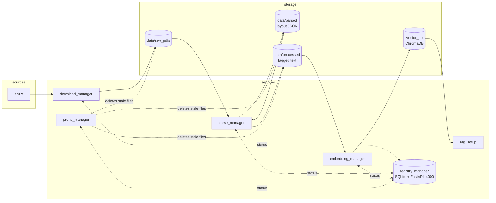

# System Architecture

A local RAG pipeline over research papers, designed to run on a single machine
with a 4GB GPU (GTX 1650). Six services cooperate through a shared `data/`
directory and a central registry that tracks each paper's lifecycle status.

## Pipeline overview



## File lifecycle

Every paper is tracked in the registry by filename stem, moving through:

```
downloaded → parsed → processed → embedded    (or → error)
```

| Status | Set by | Meaning |
|---|---|---|
| `downloaded` | download_manager | PDF saved in `data/raw_pdfs/` |
| `parsed` | parse_manager (stage 1) | YOLO layout JSON written to `data/parsed/` |
| `processed` | parse_manager (stage 2) | Assembled tagged text in `data/processed/` |
| `embedded` | embedding_manager | Chunks embedded into ChromaDB |
| `error` | any | Failure recorded with an error message |

## Services

### registry_manager (FastAPI, port 4000)
Central source of truth. SQLite table keyed by filename with status,
timestamps, error counts, paper domain, and publish date. Endpoints:
`POST /update_status`, `GET /get_status`, `POST /get_last_checkpoint`
(latest downloaded paper date per domain, used to resume downloads).

### download_manager
Searches arXiv per configured domain (one thread each), newest-first back to
the domain's checkpoint (the newest `published_at` the registry holds, else
`BACKFILL_DAYS`). Papers the registry already knows are skipped; new ones
are downloaded into `data/raw_pdfs/` and registered as `downloaded` with
domain and publish date. `MAX_PAPERS_PER_DOMAIN` caps each cycle so an
overnight run stays bounded. Aborts a cycle if the registry is down rather
than downloading files the pipeline would never see. PDFs added by hand are
registered with `scripts/register_pdfs.py`.

### parse_manager
Two-stage, layout-aware parsing driven by a fine-tuned YOLOv11 document-layout
model. Stage 1 (`pdf_parser.py`) turns a PDF into a region-level layout JSON;
stage 2 (`txt_processor.py`) assembles reading-ordered, tagged text. See
[parse_manager.md](parse_manager.md) for the full design.

### embedding_manager (FastAPI, port 4001)
Background loop chunks each processed paper's `.json` blocks with a
**structure-aware chunker** (`chunking.py`: heading path prefixed to every
chunk, whole paragraphs packed to ~1500 chars, sentence-boundary splits only
for oversized paragraphs, captions travel with their tables, formulas inline,
authors/footnotes excluded) and embeds with **`BAAI/bge-base-en-v1.5`**
(512-token window, normalized, query-side instruction) into a persistent
ChromaDB collection (cosine/HNSW). Each chunk carries filterable, editable
metadata — `filename`, `title`, `section`, `page_start`/`page_end`,
`block_types`, `chunk_index` — that is stored alongside the vector, never
embedded. Serves `GET /get_chunks` (retrieval, `n_results` + filename
filter) and `GET /list_files`.

### rag_setup
Query-side CLI: retrieves top chunks from the embedding service and answers
with a grounded, citation-forcing prompt. Two backends (`LLM_BACKEND`):
`local` (default) uses Qwen3-4B served by Ollama on this machine —
retrieval stays tight (6 chunks) so the 4B model stays grounded; `gemini`
(`gemini-2.5-flash`, needs `GEMINI_API_KEY`) remains the higher-quality
option for multi-paper synthesis.

### UI (FastAPI, port 4002)
Local web chat interface (`UI/`) — an alternative to the `rag_setup` CLI.
Reuses the same retrieval + answering code, streams local-backend answers
token-by-token, renders numbered source chunks with clickable citations,
offers a per-paper filter (via the embedding service's `/list_files`), a
local/gemini backend toggle, and live health dots for Ollama and the
embedding service. Single self-contained HTML page, no build step.

### prune_manager
Every `PRUNE_INTERVAL` (30 min) deletes `data/parsed/` files once a paper is
`processed`/`embedded` and `data/processed/` files once `embedded`. **Raw
PDFs are kept** (`PRUNE_RAW_PDFS = False`): they are the only input the
pipeline can be rebuilt from, and the planned VLM pass over figures/tables
needs their page images. Flip the flag if disk is genuinely scarce.

## Directory layout

```
RAGSetup/
├── docs/                  # documentation (this file)
├── diagrams/              # drawio / mermaid architecture diagrams
├── tests/                 # pytest suite (heuristics + end-to-end)
├── download_manager/
├── parse_manager/
├── prune_manager/
├── embedding_manager/
├── registry_manager/
├── rag_setup/
├── UI/                    # web chat interface (port 4002)
├── scripts/               # one-off utilities (model download, pdf→image)
├── models/                # YOLO weights (git-ignored)
├── data/                  # raw_pdfs / parsed / processed (git-ignored)
├── vector_db/             # ChromaDB store (git-ignored)
└── virtual_environments/  # per-service venvs (git-ignored)
```

## GPU budget (4GB)

The GPU is time-shared, not partitioned:

- **Overnight (ingestion)**: YOLO layout model (small, batch 4 at imgsz 1024)
  and the bge-base embedder (~1GB peak) run on CUDA. The layout detector
  automatically falls back to CPU when CUDA memory is exhausted (e.g., while
  a training job is running).
- **Daytime (querying)**: Qwen3-4B Q4 (~2.5GB weights + 8K KV cache) gets the
  card to itself; Ollama frees the VRAM after 30 minutes idle. Query-time
  embedding is a single MiniLM forward pass — set `EMBED_DEVICE=cpu` to keep
  it off the GPU entirely.
