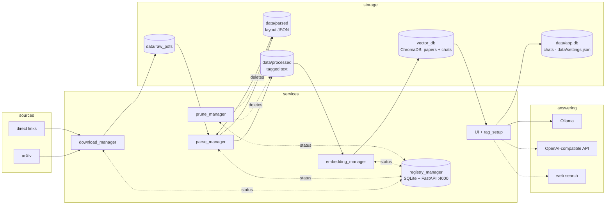

# System Architecture

A local RAG pipeline over research papers, designed to run on a single machine
with a 4GB GPU (GTX 1650). Six services cooperate through a shared `data/`
directory and a central registry that tracks each paper's lifecycle status.

> This page is the short overview. For the full account of what happens
> inside every module, why, and what triggers it — with data formats at
> every boundary — read [SYSTEM_WALKTHROUGH.md](SYSTEM_WALKTHROUGH.md), and
> open [diagrams/system_architecture_detailed.drawio](../diagrams/system_architecture_detailed.drawio)
> (page 1: system; pages 2–8: one per module).

## Pipeline overview



## File lifecycle

Every paper is tracked in the registry by filename stem:

```
downloaded → parsed → processed → embedded      (any stage may set → error)
```

| Status | Set by | Meaning |
|---|---|---|
| `downloaded` | download_manager / `scripts/register_pdfs.py` | PDF in `data/raw_pdfs/` |
| `parsed` | parse_manager stage 1 | YOLO layout JSON in `data/parsed/` |
| `processed` | parse_manager stage 2 | assembled tagged text in `data/processed/` |
| `embedded` | embedding_manager | chunks in ChromaDB |
| `error` | the failing stage | `last_error` holds the message; skipped until retried (`register_pdfs.py --retry-errors`) |

## Services

### registry_manager (FastAPI, port 4000)
Single source of truth. SQLite row per paper with status, per-stage
timestamps, error count/message, arXiv domain and publish date. API:
`GET /v1/papers[?status]`, `GET /v1/papers/{stem}`,
`PUT /v1/papers/{stem}/status`, `GET /v1/domains/{d}/checkpoint`,
`GET /v1/stats` (counts, average seconds per stage, errors — what the
Ingestion page's ETA is built from). Every other stage talks to it through
`common/registry_client.py`.

### download_manager
Crawls arXiv per configured domain, newest-first back to the domain's
checkpoint, skipping papers the registry knows, capped per domain per
cycle; registers each download with domain and publish date. Also takes
direct links (`--url`, arXiv abs/pdf links get their real title), one-shot
runs (`--once`, `--domain`, `--max`), and `--ensure-registry` for
timer-driven runs (`ops/systemd/`).

### parse_manager
Two-stage, layout-aware parsing. Stage 1 (`pdf_parser.py`): fine-tuned
YOLOv11 layout detection (`MODEL_CANDIDATES`: small → v2224 → nano, run
through **onnxruntime** — ultralytics is a build-time-only dependency) +
PyMuPDF words → region-level layout JSON, with wide regions split at column
gutters. Stage 2 (`txt_processor.py`):
reading order, paragraph assembly (with document-aware de-hyphenation),
tags. `PARSER_BACKEND = "docling"` swaps stage 1 for IBM Docling
(`docling_backend.py`) with the same output contract. See
[parse_manager.md](parse_manager.md).

### embedding_manager (FastAPI, port 4001)
Structure-aware chunking (`chunking.py`) and `BAAI/bge-base-en-v1.5`
embeddings into ChromaDB — collection `papers_bge_base_v1`, plus
`chats_bge_base_v1` for conversations the user saves to memory. API:
`POST /v1/search` (papers and/or chats, filename filter), `GET /v1/papers`,
`POST /v1/chats`, `DELETE /v1/chats/{id}`.

### rag_setup + UI (FastAPI, port 4002)
`rag_setup/rag.py` does retrieval (paper chunks, optional saved chats,
optional live web pages via DuckDuckGo + trafilatura), builds the numbered,
labeled context, and streams the answer from the configured backend:
`local` (Ollama) or `openai` (any OpenAI-compatible API — base URL, key,
model from Settings). `UI/main.py` exposes this as `POST /v1/query`
(ndjson events), plus settings, chats, ingestion progress and live log
endpoints, and serves the React app (`UI/frontend` → `UI/static`; legacy
`UI/index.html` as fallback).

### prune_manager
Every 30 minutes deletes `data/parsed/` files once a paper is
processed/embedded and `data/processed/` once embedded. Raw PDFs are kept
by default; `RAW_PDF_ARCHIVE_DIR` moves embedded PDFs elsewhere,
`RAW_PDF_DELETE` deletes them, with a keep-newest/oldest-N strategy.

### common/
Shared by all services: `paths.py`, `logsetup.py` (one log format, level
via `RAG_LOG_LEVEL`), `registry_client.py`, `settings.py`
(`data/settings.json`, env-seeded, UI-editable), `chatstore.py`
(`data/app.db`).

### scripts/ops.py
Cross-platform process management (psutil): `fresh-start`, `start-query`,
`stop`, `daily-ingest`, `start`/`restart`. The `.sh` files wrap it.

## Directory layout

```
RAGSetup/
├── common/                # shared: paths, logging, registry client, settings, chats
├── docs/  diagrams/  tests/
├── download_manager/  parse_manager/  prune_manager/
├── embedding_manager/  registry_manager/  rag_setup/
├── UI/                    # main.py (API) · frontend/ (React source) · static/ (build) · index.html (legacy)
├── ops/systemd/           # daily-ingest timer units + install.sh
├── scripts/               # ops.py, rag_inspect.py, register_pdfs.py, docling_compare.py, …
├── models/*  data/*  vector_db/*  run/*  virtual_environments/*     (* git-ignored)
```

## GPU budget (4GB)

Time-shared, not partitioned:

- **Ingestion**: YOLO layout model (small, batch 4 at imgsz 1024) and the
  bge-base embedder (~1GB peak) on CUDA; YOLO falls back to CPU on OOM.
- **Querying**: the LLM alone (Qwen3-4B Q4 ≈ 3.5GB with a 6144-token
  cache); the embedder runs on CPU (`EMBED_DEVICE=cpu`, set by
  `ops.py start-query`). All three at once need ~5.5GB and don't fit — the
  start scripts unload Ollama models so each session begins with a clean
  GPU placement. `scripts/hardware_check.py` maps VRAM to model choices.
