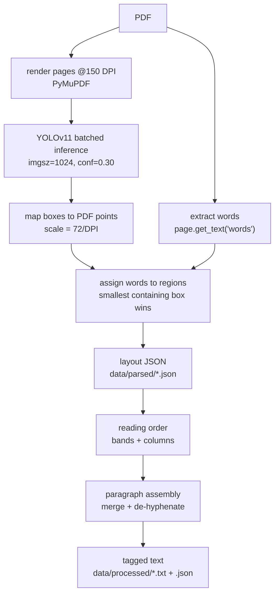

# Parse Manager — Layout-Aware PDF Parsing

## Why layout detection

Plain text extraction (PyMuPDF blocks + spacing heuristics) could not answer
questions that determine chunk quality:

- Are two pieces of text part of the same paragraph?
- Is a piece of text body text, or text drawn *inside* a figure?
- When text continues on the next page, is the first line a page header or a
  paragraph continuation?
- Which column does a block belong to, and in what order should columns be
  read?

A fine-tuned **YOLOv11 document-layout model** answers these visually:
each page is rendered to an image and every region is detected with a class
and bounding box. Heuristics then only have to *order and join* regions, not
guess what they are.

**Model**: first existing candidate wins (`MODEL_CANDIDATES` in `config.py`),
each loaded from its **`.onnx`** export next to the `.pt`:

1. `models/yolo11s_doc_layout_imgsz_1024/weights/best.onnx` — fine-tuned small (preferred)
2. `models/yolo11_doc_layout_v2224_imgsz_1024/weights/best.onnx` — 1st fallback
3. `models/yolo11n_doc_layout_imgsz_1024/weights/best.onnx` — last fallback

All were fine-tuned at imgsz 1024 from `Armaggheddon/yolo11-document-layout`
on annotated research papers. Classes:

```
Caption, Footnote, Formula, List-item, Page-footer, Page-header,
Picture, Section-header, Table, Text, Title, Authors
```

## Inference runs on onnxruntime, not ultralytics

`ultralytics` is **not a runtime dependency** — it is AGPL-3.0, and importing
it in shipped software would impose copyleft on the whole product
([PENDING_IMPROVEMENTS.md](PENDING_IMPROVEMENTS.md) item 4). Instead:

- `scripts/export_onnx.py` converts each `best.pt` to `best.onnx` **once, at
  build time**. Running ultralytics privately to produce a file is not
  distribution, so the AGPL places no restriction on it.
- `onnx_detector.py` loads the `.onnx` with **onnxruntime** (MIT) and does
  preprocessing, decoding and NMS in numpy. Class names, `imgsz` and `stride`
  travel inside the ONNX metadata, so a `.onnx` file is self-describing.
- `layout_detector.py` refuses to start if only a `.pt` is present, telling
  you to run the export.

**This was verified as an exact behavioural swap**, not an approximation:
across 3 papers / 30 pages, **407 of 407 regions matched** the ultralytics
output at IoU > 0.995 (mean IoU 0.9999), with zero extra or missing boxes and
a maximum confidence difference of 0.00005. Three details had to match
exactly to get there, each of which silently shifted results when wrong:

| Detail | Wrong version | Effect |
|---|---|---|
| Resampler | Pillow BILINEAR (antialiases when downscaling) | confidences moved up to 0.35 — enough to drop a real region below `YOLO_CONF` |
| Padding | full 1024 square | ultralytics pads only to the next stride multiple when a batch is uniformly shaped, so a page runs at 1024x800 and the model sees different context |
| Inverse transform | float half-difference | boxes off by half a pixel; small regions (page footers) fell to IoU 0.94 |

**Batch shape must stay constant.** The CUDA provider re-tunes its
convolution algorithms for every new input shape, so a short final batch
costs more than the pages it saves — measured 4.2 pages/s with varying
shapes versus 17 pages/s with a fixed batch. `predict(fixed_batch=…)` pads a
short tail batch by repeating its last page and discards the extra results.

Speed is unchanged by the migration: **10–14 pages/s** end to end on the
GTX 1650, the same as the ultralytics path. GPU use needs `onnxruntime-gpu`
plus CUDA 12.x / cuDNN 9.x; when those come from the `nvidia-*-cu12` wheels
rather than a system install, `onnx_detector.py` preloads them so the CUDA
provider can resolve them (otherwise it silently falls back to CPU, ~2
pages/s).

## Two-stage pipeline



### Stage 1 — `pdf_parser.py` (PDF → layout JSON)

1. **Render** each page at 150 DPI with PyMuPDF (no poppler dependency).
2. **Detect** regions with YOLO in batches of 4 pages (fits the 4GB GPU;
   automatic CPU fallback if GPU inference fails — see `layout_detector.py`).
   A short final batch is padded so the input shape never changes.
3. **Map** pixel boxes back to PDF points so they can be intersected with
   PyMuPDF's word coordinates.
4. **Assign words to regions**: each word goes to the *smallest* detected
   region containing its center — so a Caption lying on top of a Picture
   claims its own words.
   - Words inside `Picture` / `Page-header` / `Page-footer` boxes and in no
     smaller region are **swallowed**: recorded in the JSON but excluded from
     the text flow. This is what removes figure-internal text and running
     headers.
   - Words covered by **no** detection are grouped (by PyMuPDF block) into
     fallback `Text` regions with `conf: 0.0`, so model misses never lose
     content.
5. **Column splitting** (`split_region_columns`): a region at least half the
   page wide is checked for **gutters** — x-intervals that *no* word in the
   region crosses, about a line-height wide, with words on both sides on two
   or more text rows. Such a region is split into one region per column
   before lines are built. Both conditions matter: running prose always has
   some line covering any given x, and the row test rejects the one-off wide
   space of a centred heading. The threshold scales with the region's own
   font (word spaces run ~2.5pt where real gutters run ~12pt), so it is not
   a tuned constant.

   This fixes two real cases the layout model produces:
   - a **3-across `Authors` block** detected as one box, which would
     otherwise read "Alice Bob Carol Univ A Univ B Univ C";
   - a **mid-page column merge**, where a two-column stretch is detected as
     one wide `Text` box and its lines would be stitched together across the
     gutter.

   Split parts are marked `column_split: true` in the JSON.
6. **Line building**: each region's words are clustered into lines by
   y-center (tolerance = 0.6 × median word height) and sorted left-to-right.

Output (`data/parsed/<name>.json`): per page, `width`/`height`, regions with
`label`, `conf`, `bbox`, `lines`, plus `swallowed_text`.

### Stage 2 — `txt_processor.py` (layout JSON → tagged text)

**Reading order** (`order_regions`): page headers/footers are dropped first.
Pages whose textual regions are mostly full-width (≥ `SINGLE_COLUMN_FRACTION`)
are treated as single-column and read straight down. Otherwise the page is
two-column, and two kinds of region act as **separators** that interrupt the
column flow and are read on their own:

- **full-width regions** (width > `FULL_WIDTH_FRACTION` of the page) — a
  spanning figure, a wide table, or a mid-page column merge. Everything in
  the columns *above* is read first, then the separator, then the columns
  below it. This is exactly the desired behaviour for a merged region that
  stage 1's column splitting did not divide.
- **`Authors` boxes**, which sit in the title band but are usually narrow
  and would otherwise be sorted into a body column.

Separators that sit side by side (the usual author row) are detected as one
row and read **left-to-right**; stacked separators keep top-to-bottom order.
Within an ordinary band, the left column is read top-to-bottom before the
right.

**Paragraph assembly** (`LayoutAssembler`): walks regions in reading order.

- `Text` regions ≈ paragraphs (that is what the model was trained on). A new
  region *continues* the open paragraph when the paragraph does not end with
  terminal punctuation (`.!?`, allowing a trailing quote/bracket) — this joins
  paragraphs split across columns and pages.
- Continuation survives *intervening* captions, footnotes, and figures: the
  paragraph block keeps the position where it started while the interleaved
  blocks are emitted in place.
- **De-hyphenation**: a line-ending `-` is dropped before a lowercase
  continuation (`construc-` + `tion` → `construction`) and kept before an
  uppercase one (`non-` + `Euclidean` → `non-Euclidean`).
- Consecutive `List-item` regions group into one block, one item per line.
- `Title` / `Section-header` / `Authors` force a paragraph break.

**Output format** (`data/processed/<name>.txt`) — blocks separated by blank
lines so the embedder's `\n\n`-first splitter cuts on real boundaries:

```
# Paper Title
[AUTHORS] ...
## Section heading
Body paragraphs (merged, de-hyphenated).
[CAPTION] Figure 1: ...
[TABLE] ... [/TABLE]
[FORMULA] ...
[FOOTNOTE] ...
```

A companion `<name>.json` keeps the typed block list plus everything that was
dropped (page headers/footers, picture-internal text) for auditability.

## Service loop — `main.py`

Two daemon threads poll the registry every 5s:

| Loop | Acts on status | Produces | New status |
|---|---|---|---|
| parser | `downloaded` | `data/parsed/*.json` | `parsed` |
| processor | `parsed` | `data/processed/*.{txt,json}` | `processed` |

A stage that raises records `error` with the message (the paper is then
skipped until `scripts/register_pdfs.py --retry-errors`).

## Alternative backend — Docling

`PARSER_BACKEND = "docling"` swaps stage 1 for IBM Docling
(`docling_backend.py`), which maps its output onto the same layout JSON so
stage 2 runs unchanged. Docling brings **TableFormer**, which reconstructs
table structure instead of grouping words into lines.

Measured on this machine (GTX 1650, two papers, 10 pages each, **both
backends warmed first so model-load time is excluded**, and both compared as
complete pipelines — the YOLO arm includes PyMuPDF rendering and word
extraction, and both feed the same stage 2):

| | PyMuPDF + YOLO (fine-tuned small) | Docling |
|---|---|---|
| Throughput | 15.9 and 10.4 pages/s (avg **13.1**) | 1.4 and 3.6 pages/s (avg **2.5**) |
| Peak VRAM | 883 MB | 913–1043 MB |
| Tables | word rows, no column structure | Markdown with headers and aligned cells |

Docling is **~5× slower** and uses ~150 MB more VRAM. Two measurement traps
are worth knowing, because both made Docling look far worse before they were
controlled for:

- **Model load dominates a cold run.** Uncorrected first runs showed 0.07
  pages/s — nearly all of it loading models. Always warm before timing.
- **OCR is on by default and runs on CPU.** arXiv PDFs are born-digital, so
  their text layer is already present and the OCR pass is pure overhead;
  `docling_backend.py` disables it (`DOCLING_OCR=1` re-enables it for scanned
  documents). This alone accounted for a 6× difference.

The pragmatic reading: keep YOLO as the default — a 46-paper ingest is
minutes either way, and 5× is not the 30× it first appeared — and reach for
Docling when a corpus is table-heavy. The same Table 1 comes out of Docling
as aligned Markdown with headers, versus a flat run of numbers from the
line-grouping path.

## Tuning knobs (`config.py`)

| Setting | Default | Meaning |
|---|---|---|
| `MODEL_CANDIDATES` | s → v2224 → n | layout weights, first existing wins |
| `PARSER_BACKEND` | `"yolo"` | `"docling"` to use Docling for stage 1 |
| `RENDER_DPI` | 150 | page raster resolution |
| `YOLO_IMGSZ` | 1024 | must match fine-tuning imgsz |
| `YOLO_CONF` | 0.30 | detection confidence threshold |
| `YOLO_IOU` | 0.70 | NMS IoU threshold (ultralytics' `predict` default, which is what the corpus was parsed with) |
| `YOLO_BATCH` | 4 | pages per batch (4GB GPU); also the fixed shape short batches are padded to |
| `FULL_WIDTH_FRACTION` | 0.6 | band-separator width threshold |
| `SINGLE_COLUMN_FRACTION` | 0.7 | single-column page detection |

Column splitting has no config knob: its gutter threshold is derived from
each region's own font size (see stage 1, step 5).
