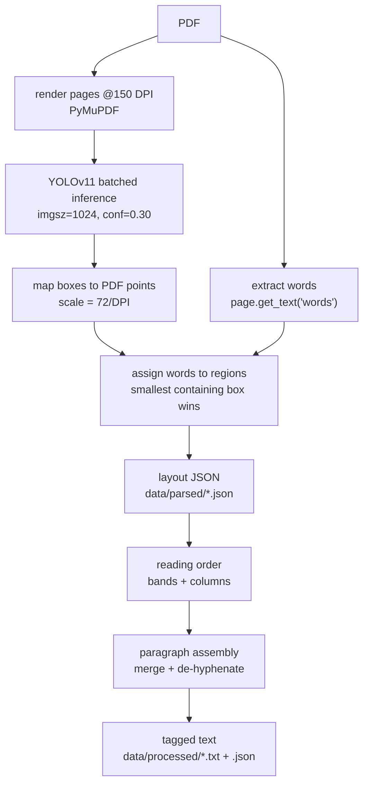

# Parse Manager — Layout-Aware PDF Parsing

## Why layout detection

Plain text extraction (PyMuPDF blocks + spacing heuristics) could not answer
questions that determine chunk quality:

- Are two pieces of text part of the same paragraph?
- Is a piece of text body text, or text drawn *inside* a figure?
- When text continues on the next page, is the first line a page header or a
  paragraph continuation?
- Which column does a block belong to, and in what order should columns be
  read?

A fine-tuned **YOLOv11 document-layout model** answers these visually:
each page is rendered to an image and every region is detected with a class
and bounding box. Heuristics then only have to *order and join* regions, not
guess what they are.

**Model**: first existing candidate wins (`MODEL_CANDIDATES` in `config.py`):

1. `models/yolo11s_doc_layout_imgsz_1024/weights/best.pt` — fine-tuned small (preferred)
2. `models/yolo11n_doc_layout_imgsz_1024/weights/best.pt` — fine-tuned nano
3. `models/yolo11n_doc_layout.pt` — pretrained fallback

Both fine-tuned models were trained at imgsz 1024 from
`Armaggheddon/yolo11-document-layout` on annotated research papers. Classes:

```
Caption, Footnote, Formula, List-item, Page-footer, Page-header,
Picture, Section-header, Table, Text, Title, Authors
```

The pretrained fallback can be fetched with
`scripts/download_layout_model.py`.

## Two-stage pipeline



### Stage 1 — `pdf_parser.py` (PDF → layout JSON)

1. **Render** each page at 150 DPI with PyMuPDF (no poppler dependency).
2. **Detect** regions with YOLO in batches of 4 pages (fits the 4GB GPU;
   automatic CPU fallback on CUDA OOM — see `layout_detector.py`).
3. **Map** pixel boxes back to PDF points so they can be intersected with
   PyMuPDF's word coordinates.
4. **Assign words to regions**: each word goes to the *smallest* detected
   region containing its center — so a Caption lying on top of a Picture
   claims its own words.
   - Words inside `Picture` / `Page-header` / `Page-footer` boxes and in no
     smaller region are **swallowed**: recorded in the JSON but excluded from
     the text flow. This is what removes figure-internal text and running
     headers.
   - Words covered by **no** detection are grouped (by PyMuPDF block) into
     fallback `Text` regions with `conf: 0.0`, so model misses never lose
     content.
5. **Line building**: each region's words are clustered into lines by
   y-center (tolerance = 0.6 × median word height) and sorted left-to-right.

Output (`data/parsed/<name>.json`): per page, `width`/`height`, regions with
`label`, `conf`, `bbox`, `lines`, plus `swallowed_text`.

### Stage 2 — `txt_processor.py` (layout JSON → tagged text)

**Reading order** (`order_regions`): page headers/footers are dropped first.
Full-width regions (width > 60% of page) and `Authors` boxes act as *band
separators*; within each band, the left column is read top-to-bottom before
the right. Pages whose textual regions are mostly full-width are treated as
single-column and read straight down.

**Paragraph assembly** (`LayoutAssembler`): walks regions in reading order.

- `Text` regions ≈ paragraphs (that is what the model was trained on). A new
  region *continues* the open paragraph when the paragraph does not end with
  terminal punctuation (`.!?`, allowing a trailing quote/bracket) — this joins
  paragraphs split across columns and pages.
- Continuation survives *intervening* captions, footnotes, and figures: the
  paragraph block keeps the position where it started while the interleaved
  blocks are emitted in place.
- **De-hyphenation**: a line-ending `-` is dropped before a lowercase
  continuation (`construc-` + `tion` → `construction`) and kept before an
  uppercase one (`non-` + `Euclidean` → `non-Euclidean`).
- Consecutive `List-item` regions group into one block, one item per line.
- `Title` / `Section-header` / `Authors` force a paragraph break.

**Output format** (`data/processed/<name>.txt`) — blocks separated by blank
lines so the embedder's `\n\n`-first splitter cuts on real boundaries:

```
# Paper Title
[AUTHORS] ...
## Section heading
Body paragraphs (merged, de-hyphenated).
[CAPTION] Figure 1: ...
[TABLE] ... [/TABLE]
[FORMULA] ...
[FOOTNOTE] ...
```

A companion `<name>.json` keeps the typed block list plus everything that was
dropped (page headers/footers, picture-internal text) for auditability.

## Service loop — `main.py`

Two daemon threads poll every 5s:

| Loop | Watches | Acts on status | Produces | New status |
|---|---|---|---|---|
| parser | `data/raw_pdfs/*.pdf` | `downloaded` | `data/parsed/*.json` | `parsed` |
| processor | `data/parsed/*.json` | `parsed` | `data/processed/*.txt` | `processed` |

## Tuning knobs (`config.py`)

| Setting | Default | Meaning |
|---|---|---|
| `RENDER_DPI` | 150 | page raster resolution |
| `YOLO_IMGSZ` | 1024 | must match fine-tuning imgsz |
| `YOLO_CONF` | 0.30 | detection confidence threshold |
| `YOLO_BATCH` | 4 | pages per batch (4GB GPU) |
| `FULL_WIDTH_FRACTION` | 0.6 | band-separator width threshold |
| `SINGLE_COLUMN_FRACTION` | 0.7 | single-column page detection |
