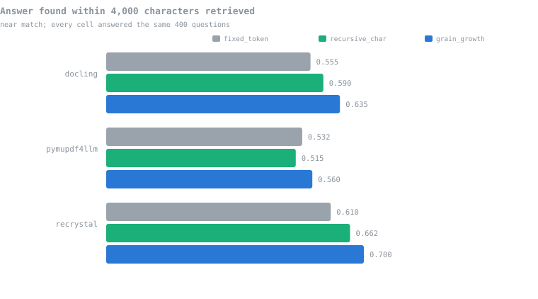
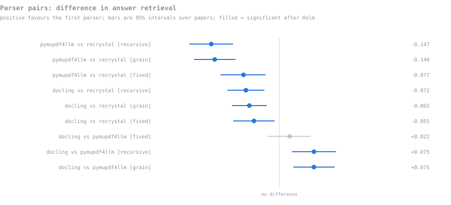
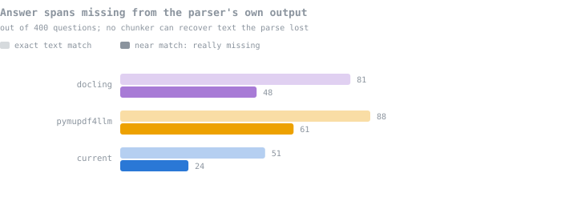
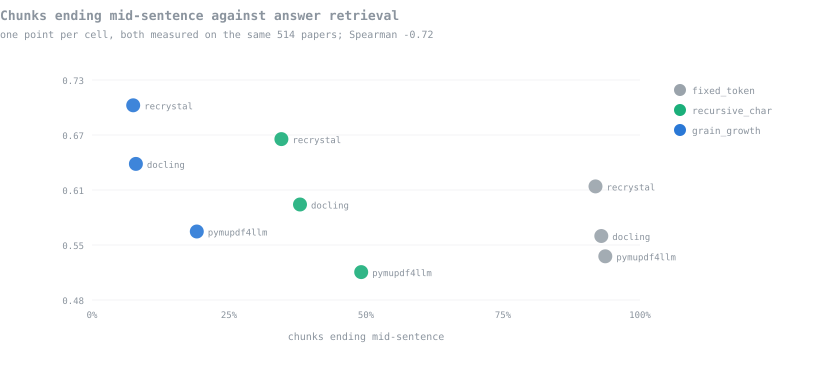

# Parser and chunking evaluation: rounds 1 and 2

Generated by `evals/scripts/make_round2_report.py` on 2026-09-17 06:20:54 +0530. Every number is read from the result files; every verdict is computed by `round2_analysis.py` using the rules fixed in `round2_preregistration.json` before the run started (2026-09-14 16:55:27 +0530), with 4 logged amendments.

## In short

| Question | Answer |
|---|---|
| Does Grain-Growth retrieve better than `fixed_token`? | **Yes** |
| Does Grain-Growth retrieve better than `recursive_char`? | **No established difference** — the gap is real in direction but below the threshold fixed before the run |
| Does Grain-Growth produce better answers? | **No established difference** against either splitter |
| Does the parser matter for retrieval? | **Yes.** `current` beats both open-source parsers under every chunker; Docling beats PyMuPDF4LLM |
| Which parser loses the fewest answers? | `current` (24 of 400), then Docling (48), then PyMuPDF4LLM (61) |
| Can this run measure faithfulness or context sufficiency? | **No.** Both methods failed their checks, and both were demoted before any comparison was run |

## What round 1 left unanswered

Round 1 crossed 20 parser-chunker cells for chunk shape over 15 papers, and ran 12 retrieval cells over 103 papers with 100 questions. It settled three things and left three open.

| Question | Round 1 | Why it could not go further |
|---|---|---|
| Semantic chunking | **Settled**: last at an equal character budget on every parser, and 2.2x slower | — |
| Scoring at a fixed top-k | **Settled**: it flatters large chunks | — |
| Answers lost in parsing | **Settled in direction** | Exact text matching penalised Docling, whose text engine differs |
| Grain-Growth vs the simple splitters | **Open** | 100 questions was too few; about 350-400 needed |
| Does the parser change retrieval | **Open** | Questions written from `current`'s own output inflated its score by 23-29 points, leaving ~30 neutral questions per pair |
| Are answer scores trustworthy | **Open** | The answering model judged its own answers |

## What round 2 changed

| Gap | Change |
|---|---|
| Too few questions | 400 questions from 400 different papers, up from 100 |
| Question bias | Questions written from neutral `pdftotext` output, which none of the three parsers uses. Every question is neutral, so no home-advantage correction is needed. |
| Self-judging | The answering model never judges. Scoring is a local NLI classifier plus Gemma 3 4B, and no external API is called. |
| Text-engine bias | Every span metric is computed twice, exact and near match (90% of the span's words); verdicts use near match. |
| Corpus too small | 514 papers, 7,732 pages (95 fresh arXiv, 419 never used in YOLO training), up from 103 |
| Shape and retrieval on different corpora | Chunk shape re-measured on the same 514 papers the retrieval run used |
| Cherry-picking risk | Metrics, tests, thresholds and verdict rules fixed in writing before the run, with every later change logged as an amendment |

Questions were written by `openai/gpt-oss-120b` and a fallback, verified against two independent text engines: 1016 generated, 754 passed (74%), 400 shortlisted, one per paper. Rejections: 69 span not found in PyMuPDF text (engines disagree); 82 question not self-contained; 5 answer is a citation; 94 span not verbatim in pdftotext text; 11 span too short to be evidence; 1 question too short.

## Round 2 results

Every cell answered the same 400 questions, so all comparisons are paired.

### The nine cells

| Parser | Chunker | Chunks | **Span@4k near** | Span@5 near | Precision@5 near | Fact recall | Judge correctness |
|---|---|---|---|---|---|---|---|
| `oss_docling` | `fixed_token` | 34,390 | **0.555** | 0.580 | 0.701 | 0.586 | 0.733 |
| `oss_docling` | `recursive_char` | 28,081 | **0.590** | 0.623 | 0.678 | 0.568 | 0.787 |
| `oss_docling` | `grain_growth` | 31,646 | **0.635** | 0.652 | 0.694 | 0.621 | 0.806 |
| `oss_pymupdf4llm` | `fixed_token` | 38,696 | **0.532** | 0.560 | 0.698 | 0.572 | 0.720 |
| `oss_pymupdf4llm` | `recursive_char` | 25,928 | **0.515** | 0.552 | 0.669 | 0.599 | 0.755 |
| `oss_pymupdf4llm` | `grain_growth` | 28,708 | **0.560** | 0.565 | 0.663 | 0.610 | 0.759 |
| `current` | `fixed_token` | 30,770 | **0.610** | 0.625 | 0.694 | 0.576 | 0.743 |
| `current` | `recursive_char` | 24,225 | **0.662** | 0.688 | 0.670 | 0.592 | 0.797 |
| `current` | `grain_growth` | 29,429 | **0.700** | 0.700 | 0.695 | 0.616 | 0.794 |



### Verdicts under the pre-registered rules

A difference counts only if it is significant after Holm correction on at least 2 of the 3 comparisons in its family, loses on none, and the pooled effect reaches the metric's threshold. For a chunker comparison the family is the three parsers; for a parser comparison it is the three chunkers. Metrics are tested in priority order and stop at the first one that fails.

**Retrieval:**

| Grain-Growth vs | Metric | Verdict | Detail |
|---|---|---|---|
| `recursive_char` | span_hit_near@4000ch | **no established difference** | significant on only 0 of 3 parsers; pooled effect +0.043 below the 0.05 threshold |
| `fixed_token` | span_hit_near@4000ch | **better** | significant on 2 of 3 parsers, pooled +0.066 |
| `fixed_token` | span_hit_near@5 | **better** | significant on 2 of 3 parsers, pooled +0.051 |
| `fixed_token` | precision_near@5 | **no established difference** | significant on only 1 of 3 parsers; pooled effect -0.014 below the 0.2 threshold |

**Answers:**

| Grain-Growth vs | Metric | Verdict | Detail |
|---|---|---|---|
| `recursive_char` | nli_fact_recall | **no established difference** | significant on only 1 of 3 parsers; pooled effect +0.030 below the 0.05 threshold |
| `fixed_token` | nli_fact_recall | **no established difference** | significant on only 0 of 3 parsers; pooled effect +0.038 below the 0.05 threshold |

Per-parser tests behind the primary retrieval metric (`span_hit_near@4000ch`):

| Grain-Growth vs | Parser | n | W / L | p | Holm | Difference | 95% interval |
|---|---|---|---|---|---|---|---|
| `recursive_char` | `oss_docling` | 400 | 37 / 19 | 0.022 | no | +0.045 | [+0.007, +0.083] |
| `recursive_char` | `oss_pymupdf4llm` | 400 | 43 / 25 | 0.038 | no | +0.045 | [+0.005, +0.085] |
| `recursive_char` | `current` | 400 | 43 / 28 | 0.096 | no | +0.037 | [-0.003, +0.080] |
| `fixed_token` | `oss_docling` | 400 | 55 / 23 | <0.001 | yes | +0.080 | [+0.037, +0.122] |
| `fixed_token` | `oss_pymupdf4llm` | 400 | 49 / 38 | 0.284 | no | +0.028 | [-0.018, +0.072] |
| `fixed_token` | `current` | 400 | 67 / 31 | <0.001 | yes | +0.090 | [+0.043, +0.138] |

### Parsers

Round 1 could not rank parsers because its questions favoured one of them. Round 2's questions come from neutral text, so every question counts for every parser.

On the primary metric, 8 of 9 pairwise tests are significant after Holm. Differences are written so that a positive number favours the **first** parser named.

Applying the same rule to parser pairs, under all three chunkers:

| Pair | Verdict | Detail |
|---|---|---|
| oss_docling vs oss_pymupdf4llm | **better** | significant on 2 of 3 chunkers, pooled +0.057 |
| oss_docling vs current | **worse** | significant loss on 3 of 3 chunkers, pooled -0.064 |
| oss_pymupdf4llm vs current | **worse** | significant loss on 3 of 3 chunkers, pooled -0.122 |



Round 1 could not rank the parsers at all. Round 2 can, and the ordering is consistent across chunkers: `current` retrieves best, `oss_docling` second, `oss_pymupdf4llm` last.

### Answers lost before retrieval

| Parser | Missing, exact match | Missing, near match | Of |
|---|---|---|---|
| `oss_docling` | 81 | **48** | 400 |
| `oss_pymupdf4llm` | 88 | **61** | 400 |
| `current` | 51 | **24** | 400 |



Paired tests between parsers on the near-match counts: oss_docling vs oss_pymupdf4llm p=0.041; oss_docling vs current p=<0.001; oss_pymupdf4llm vs current p=<0.001. A span the parser never produced cannot be retrieved by any chunker, so this caps every cell behind it.

## Chunk shape on the same corpus

Round 1 measured shape on 15 papers and retrieval on 103, so its shape-versus-retrieval comparison spanned two different corpora. Round 2 measures both on the same 514 papers, and the chunk counts match the retrieval index exactly.

| Parser | Chunker | Chunks | Median size | No overlap | Starts mid-sentence | Ends mid-sentence |
|---|---|---|---|---|---|---|
| `oss_docling` | `fixed_token` | 34,390 | 1,011 | 14.0% | 59.7% | 92.9% |
| `oss_docling` | `recursive_char` | 28,081 | 1,248 | 60.7% | 8.3% | 38.0% |
| `oss_docling` | `grain_growth` | 31,646 | 995 | 97.0% | 1.2% | 8.0% |
| `oss_pymupdf4llm` | `fixed_token` | 38,696 | 951 | 13.2% | 54.4% | 93.7% |
| `oss_pymupdf4llm` | `recursive_char` | 25,928 | 1,300 | 60.1% | 10.2% | 49.1% |
| `oss_pymupdf4llm` | `grain_growth` | 28,708 | 1,104 | 97.8% | 4.5% | 19.1% |
| `current` | `fixed_token` | 30,770 | 1,057 | 15.5% | 63.9% | 91.9% |
| `current` | `recursive_char` | 24,225 | 1,254 | 63.5% | 5.9% | 34.6% |
| `current` | `grain_growth` | 29,429 | 912 | 98.0% | 1.9% | 7.5% |

### Does chunk shape predict the outcome?

| Shape metric | Outcome | Spearman |
|---|---|---|
| mid_start_pct | span_hit_near@4000ch | -0.55 |
| mid_start_pct | nli_fact_recall | -0.75 |
| mid_start_pct | gemma_correctness | -0.85 |
| mid_end_pct | span_hit_near@4000ch | -0.72 |
| mid_end_pct | nli_fact_recall | -0.77 |
| mid_end_pct | gemma_correctness | -0.88 |
| median_chars | span_hit_near@4000ch | -0.28 |
| median_chars | nli_fact_recall | -0.20 |
| median_chars | gemma_correctness | +0.10 |
| ov_zero_pct | span_hit_near@4000ch | +0.67 |
| ov_zero_pct | nli_fact_recall | +0.73 |
| ov_zero_pct | gemma_correctness | +0.82 |



Over 9 cells, with shape and outcome measured on the same papers, which round 1 could not do. The chunker sets both the shape and the retrieval behaviour, so this is a relationship between two consequences of one choice, not evidence that fixing the shape causes the gain.

## Do the answer scores measure anything?

| Check | Result |
|---|---|
| Judge vs the objective number check | **92.9%** agreement (n=2,502); 0.99 when the number is right, 0.20 when wrong |
| Fact recall vs the objective number check | **85.3%** agreement (n=2,340); 0.80 when the number is right, 0.11 when wrong |
| The two answer metrics against each other | Pearson +0.66; fact recall 0.75 when the judge says correct, 0.04 when it says wrong |
| Judge dimensions | Identical for 94.3% of answers (correctness~faithfulness +0.94) |
| Refusals | 20.1% of answers declined to answer |

The two answer metrics were built independently, a 184M-parameter entailment classifier and a 4B judge, and they agree with each other and with the number check. That is the evidence for trusting them.

## Cost

| Parser | Pages parsed | Sec/page | Total | VRAM rise | Failures |
|---|---|---|---|---|---|
| `oss_docling` | 6,076 | 0.3958 | 40 min | 1,386 MB | 0 |
| `oss_pymupdf4llm` | 6,076 | 0.8454 | 86 min | 0 MB | 0 |
| `current` | 6,076 | 0.1375 | 14 min | 1,046 MB | 0 |

`current` parses **2.88x faster than Docling** per page on this corpus.

## What this evaluation could not measure

**Amendment 1** (2026-09-15, judge_validation (numeric reference set)) — A question joins the numeric reference set only if its reference answer passes its own numeric check, in addition to the pre-registered conditions (number in the short answer, not a citation).

> *Why:* Measured on the frozen 400 questions before scoring: 298 had a numeric non-citation short answer, but 20 of their reference answers write the number differently (for example 'a few hundredths' for 10^-2, or counts in words), so 'correct' could not be determined for them.

**Amendment 2** (2026-09-15, definition of the primary answer metric nli_fact_recall (priority 1)) — nli_fact_recall counts only the facts that the question's own reference answer entails (NLI, same model).

> *Why:* Measured on the frozen 400 questions before scoring: the reference answer entails 716 of its 937 facts (76%), all of them for 219 questions and none for 25.

**Amendment 3** (2026-09-16, supporting metrics only: nli_faithfulness, nli_context_sufficiency, nli_contradiction. No primary metric, test, threshold or verdict rule changes) — These three NLI metrics are reported as measured but unreliable, and no claim in the report rests on them.

> *Why:* Two independent problems. (1) Demonstrated false negatives: for q001, q006 and q007 the answer span was retrieved, the numeric check passed, fact recall was 1.0, and yet every context window was labelled 'neutral', giving faithfulness 0.0.

**Amendment 4** (2026-09-16, supporting metrics only: gemma_faithfulness, gemma_context_sufficiency. No primary metric, test, threshold or verdict rule changes) — gemma_faithfulness and gemma_context_sufficiency are reported as carrying no information beyond gemma_correctness, and no claim rests on them.

> *Why:* Measured on the first 500 judged answers: the three scores are identical for 467 of 500 (93%).

**Faithfulness and context sufficiency are not measured in this round.** The NLI versions produce false negatives on answers that are plainly supported, and depend mechanically on how many windows the context is split into; the judge's versions are identical to its correctness call for 93% of answers. Both were demoted before any comparison was run (amendments 3 and 4).

Metrics whose spread across the nine cells is under 5 points cannot separate the systems, whatever their pedigree: `answer_similarity` (0.9 pts), `paper_hit@10` (1.8 pts), `mrr_paper` (2.6 pts), `paper_hit@5` (2.8 pts), `rouge_l` (2.9 pts), `token_f1` (3.0 pts), `paper_hit@3` (3.2 pts), `chrf` (3.5 pts).

## What to do

- **Keep Grain-Growth, on narrower evidence than round 1 suggested.** It beats `fixed_token` on retrieval under the pre-registered rule, and against `recursive_char` the difference is **not established**: +4.3 points pooled, below the 5-point threshold fixed before the run, and significant on no parser. Round 1 predicted 350-400 questions would settle this; at 400 the answer is that the gap is real in direction and too small to establish.
- **Keep `current` for parsing, and this time retrieval supports it.** It retrieves significantly better than both open-source parsers under every chunker, and loses the fewest answer spans in parsing.
- **Answer quality does not separate the chunkers.** Neither fact recall nor the judge establishes a difference, and the judge's numbers were never reached in the priority order.

### The strongest argument against

`recursive_char` is a character splitter any library ships, and on this evidence it is not measurably worse than Grain-Growth at retrieval or at answering. Grain-Growth costs more code and more care; what it buys is the shape evidence — tables and formulas kept whole, almost no mid-sentence edges — which this evaluation shows correlates with the outcome but cannot show causes it. If you want that case closed, the next run needs questions whose answers sit inside tables and equations, where the shape difference should turn into a retrieval difference.

## What changed between the rounds

| | Round 1 | Round 2 |
|---|---|---|
| Questions | 100, written from each parser's own output | 400, written from neutral `pdftotext` |
| Papers | 103 | 514 |
| Cells | 12 (4 chunkers) | 9 (semantic dropped, settled in round 1) |
| Answer judge | The answering model judged itself | A different local model plus an entailment classifier, both validated |
| Parser ranking | Impossible: questions favoured one parser | Established, consistent across chunkers |
| Grain-Growth vs `recursive_char` | "consistent direction, insufficient evidence" | Still not established, now with 4x the questions |

The two rounds agree wherever they can be compared: Grain-Growth leads on chunk shape and on raw retrieval numbers in both, and in both the margin over `recursive_char` is too small to establish. Round 2 adds what round 1 could not: a parser ranking, and answer scores that something other than the answering model produced.

## Appendix: round-1 material

Round 1's full tables and figures are unchanged and still reproducible from its own files: `rag_results.json` (12 retrieval cells, 100 questions, 103 papers), `results.json` (chunk shape, 20 cells, 15 papers), `parser_quality.json`, `questions/round1/dataset.json` and `corpus/manifest_103.json`. Round 2 overwrote the shared paths (`questions/dataset.json`, `corpus/manifest.json`), so anything reading those now sees round-2 data.

## Reproducing

```bash
bash evals/scripts/round2_resume.sh          # parse, questions, 9 retrieval cells
python evals/scripts/score_answers.py --stage string
python evals/scripts/score_answers.py --stage nli --device cuda --batch 8
python evals/scripts/score_answers.py --stage gemma
python evals/scripts/shape_round2.py
python evals/scripts/round2_analysis.py
python evals/scripts/make_round2_figures.py
python evals/scripts/make_round2_report.py --final
```

The question set is frozen: `dataset.json` matches the SHA-256 recorded in the pre-registration, and the run refuses to start if it does not.
