# Parser and chunking harness — results

Generated by `evals/scripts/make_main_report.py` from `results.json`, `rag_results.json`, `parser_quality.json` and the corpus manifest. Every number is read from those files, and every statistic is computed from the per-question records rather than summarised by hand.

## In one paragraph

Two evaluations. A **chunk-shape run** crossed five parsers with four chunkers over 15 papers and measured what the chunks look like. A **retrieval run** put three parsers and the same four chunkers through the product's full path, retrieve then answer with `qwen3:4b-instruct` then judge, on 100 questions over 103 papers.

**Keep Grain-Growth, but for narrower reasons than the shape run suggested.** On retrieval it beats semantic chunking on 2 of 3 parsers after correction for multiple comparisons, and beats the simple splitters on 0 of 6. Its lead over `fixed_token` and `recursive_char` is consistent in direction but not statistically established at this sample size.

**On retrieval the three parsers cannot be told apart.** Questions written from `current`'s own output inflate its scores: 86.5% of its own questions find the answer in the top five, against 57.1% of everyone else's. Scored only on neutral questions, 0 of 6 pairwise parser comparisons reach significance. What separates the parsers is what reaches the index at all, plus speed: `oss_docling` loses 5, `oss_pymupdf4llm` loses 3, `current` loses 1 of the answers in parsing, allowing for text-engine differences, and `current` parses 2.81x faster than Docling.

## Corpora

**Chunk-shape run:** 15 papers, 401 pages, 50.2 MB, 10 two-column, 6 with a detectable table. Totals are recorded in `results.json`; its per-paper manifest was superseded when the corpus grew.

**Retrieval run:** 103 papers, 2,291 pages, 486.2 MB, 49 two-column, 56 with a detectable table, listed in `corpus/manifest.json`.

The target was 201 papers. The manifest was offline from cached PDFs (arXiv rate-limited a larger build). Downloads honoured the [arXiv API Terms of Use](https://info.arxiv.org/help/api/tou.html) and then went further: the interval was raised from the published three-second floor to fifteen seconds with exponential backoff, and the build stopped rather than retry into the limiter once arXiv returned 429 and then 503.

**Disjoint from the YOLO training set.** Every training PDF's arXiv id was read off its page-1 stamp, giving 1,030 ids dated 2512, 2601. The retrieval corpus is dated 0812, 1912, 2609, so the exclusion filter removed **0** candidates. Column count and table presence come from PyMuPDF geometry, never from our own layout model.

## Parsers

Chunk-shape run, 15 papers:

| Parser | Pages | Text | Sec/page | VRAM rise | Section barriers | What it is |
|---|---|---|---|---|---|---|
| `raw_dump` | 401 | 1.22 MB | 0.0319 | 0 MB | 0 | PyMuPDF `page.get_text()`, no structure |
| `legacy` | 401 | 1.07 MB | 0.0320 | 0 MB | 0 | commit `3a577c0`, page dump plus regex paragraph rules |
| `oss_docling` | 401 | 1.34 MB | 0.4462 | 1,380 MB | 406 | Docling layout, our stage-2 assembler |
| `oss_pymupdf4llm` | 401 | 1.22 MB | 0.9146 | 0 MB | 393 | PyMuPDF4LLM markdown mapped to typed blocks |
| `current` | 401 | 1.20 MB | 0.1557 | 1,044 MB | 399 | YOLOv11 layout, column-aware reading order |

`VRAM rise` is peak memory above what was already resident when the parser started; models loaded earlier stay on the card, so an absolute peak would credit every later parser with their footprint. Three of the five use no GPU.

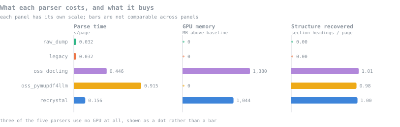

### Time gain against Docling, on the 103-paper corpus

| Parser | Pages | Sec/page | Total | VRAM rise | Failures |
|---|---|---|---|---|---|
| `oss_docling` | 2,291 | 0.3747 | 14.3 min | 1,386 MB | 0 |
| `oss_pymupdf4llm` | 2,291 | 0.7422 | 28.3 min | 0 MB | 0 |
| `current` | 2,291 | 0.1334 | 5.1 min | 1,044 MB | 0 |

| Corpus | `current` | `oss_docling` | Saved |
|---|---|---|---|
| 2,291 pages | 5.1 min | 14.3 min | 9.2 min |
| 5,000 pages | 11.1 min | 31.2 min | 20.1 min |
| 20,000 pages | 44.5 min | 124.9 min | 80.4 min |

**2.81x faster per page**, on 2,291 pages. Parsing is a one-off cost per paper, so the saving is minutes on an ingest of this size. The 342 MB of VRAM it saves is the more durable advantage on a 4 GB card shared with the embedder and the answering model.

## Chunk shape: 5 parsers x 4 chunkers (15 papers)

| Parser | Chunker | Chunks | Avg | Median | Min | Max | Ov=0 | Ov med | Ov max | Mid-start | Mid-end | Tables whole |
|---|---|---|---|---|---|---|---|---|---|---|---|---|
| `raw_dump` | `fixed_token` | 1,661 | 875 | 868 | 113 | 1,530 | 17.0% | 108 | 224 | 56.7% | 93.1% | 0.0% |
| `raw_dump` | `recursive_char` | 1,072 | 1,220 | 1,447 | 99 | 1,499 | 37.5% | 117 | 149 | 42.1% | 83.2% | 23.5% |
| `raw_dump` | `semantic` | 593 | 2,086 | 2,073 | 2 | 5,079 | 99.8% | 8 | 8 | 0.0% | 1.0% | 23.5% |
| `raw_dump` | `grain_growth` ⚠ | 1,033 | 1,265 | 1,394 | 49 | 1,990 | 39.4% | 115 | 470 | 5.5% | 31.3% | 23.5% |
| `legacy` | `fixed_token` | 1,330 | 957 | 986 | 110 | 1,590 | 14.6% | 124 | 225 | 64.9% | 92.6% | 0.0% |
| `legacy` | `recursive_char` | 859 | 1,343 | 1,439 | 156 | 1,499 | 27.7% | 104 | 149 | 40.7% | 65.9% | 0.0% |
| `legacy` | `semantic` | 529 | 2,069 | 2,075 | 42 | 2,892 | 100.0% | 0 | 0 | 0.0% | 0.8% | 0.0% |
| `legacy` | `grain_growth` ⚠ | 694 | 1,573 | 1,570 | 106 | 2,000 | 99.3% | 2 | 8 | 13.7% | 22.5% | 0.0% |
| `oss_docling` | `fixed_token` | 1,756 | 865 | 833 | 139 | 1,542 | 10.8% | 103 | 228 | 57.6% | 92.9% | 0.0% |
| `oss_docling` | `recursive_char` | 1,247 | 1,130 | 1,275 | 9 | 1,499 | 55.0% | 75 | 149 | 10.3% | 35.9% | 23.5% |
| `oss_docling` | `semantic` | 623 | 2,190 | 2,071 | 100 | 16,295 | 91.2% | 3 | 3 | 0.3% | 0.5% | 23.5% |
| `oss_docling` | `grain_growth` | 1,243 | 1,091 | 1,147 | 8 | 2,000 | 91.3% | 3 | 443 | 1.3% | 6.0% | 23.5% |
| `oss_pymupdf4llm` | `fixed_token` | 1,824 | 856 | 825 | 81 | 1,538 | 14.0% | 99 | 237 | 49.6% | 93.8% | 0.0% |
| `oss_pymupdf4llm` | `recursive_char` | 1,070 | 1,205 | 1,315 | 18 | 1,499 | 54.6% | 72 | 149 | 11.9% | 53.7% | 5.9% |
| `oss_pymupdf4llm` | `semantic` | 588 | 2,136 | 2,098 | 86 | 6,949 | 99.3% | 2 | 2 | 0.0% | 1.7% | 5.9% |
| `oss_pymupdf4llm` | `grain_growth` | 1,103 | 1,123 | 1,245 | 2 | 2,000 | 97.5% | 3 | 243 | 6.3% | 24.0% | 5.9% |
| `current` | `fixed_token` | 1,633 | 885 | 875 | 205 | 1,547 | 15.4% | 108 | 237 | 57.0% | 92.7% | 0.0% |
| `current` | `recursive_char` | 1,094 | 1,149 | 1,262 | 9 | 1,499 | 53.9% | 79 | 149 | 7.4% | 32.9% | 11.8% |
| `current` | `semantic` | 587 | 2,071 | 2,061 | 100 | 4,662 | 93.2% | 3 | 3 | 0.7% | 1.5% | 11.8% |
| `current` | `grain_growth` | 1,163 | 1,023 | 1,068 | 1 | 2,000 | 94.4% | 3 | 210 | 2.0% | 7.1% | 11.8% |

⚠ **DEGENERATE**: `raw_dump`, `legacy` with `grain_growth`. The strategy nucleates at section headings and stops at structural barriers; these parsers recover none, so it collapses to next-fit packing over blank-line-separated blocks. Run for completeness, **not a fair comparison**.

**Overlap** is the longest common suffix of chunk *i* and prefix of chunk *i+1*, on whitespace-normalised text, one definition used everywhere. **Mid-start** and **Mid-end** use the pipeline's own boundary rules: only `.`, `?` and `!` close a sentence, and a fence bar is a real boundary. **Tables whole** is the share of PyMuPDF-detected tables whose distinctive cell values land at least 80% inside one chunk.

Budgets: target 1500 characters, maximum 2000; fixed-token window 256 with 32 stride; embedding model `BAAI/bge-base-en-v1.5`.

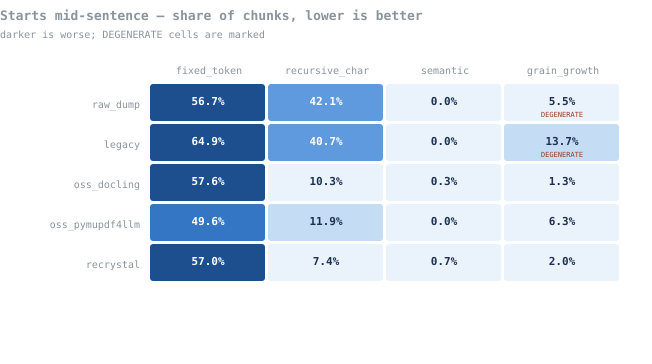

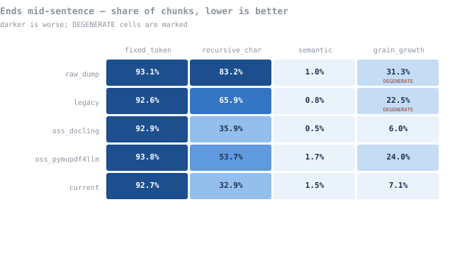

Reading down a column shows how little the parser matters once the chunker is fixed; reading across a row shows how much the chunker matters. `fixed_token` is above 90% mid-end on every parser, because a token window cuts wherever it runs out.

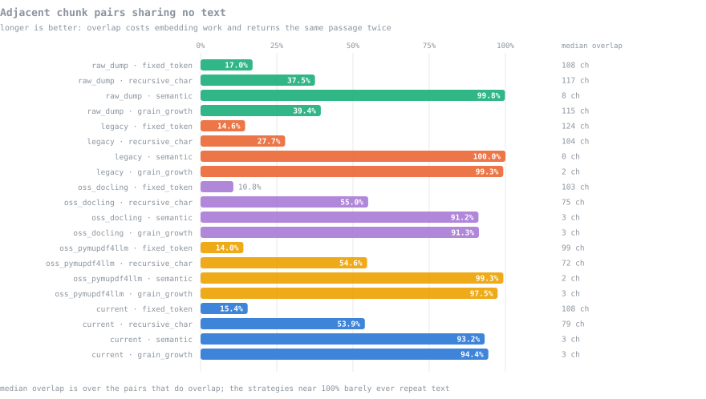

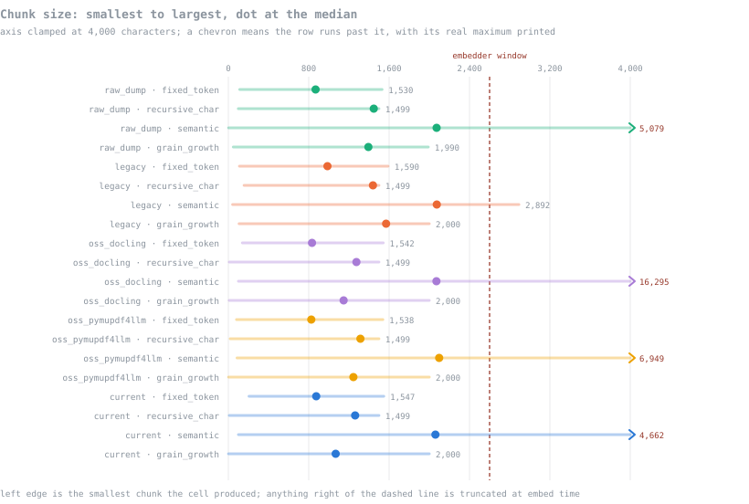

## The class gap: what Docling has no name for

The assembler is written against our twelve YOLO classes, and it runs on Docling because `LABEL_MAP` in `parse_manager/docling_backend.py` translates Docling's taxonomy into those names first. Two classes come back empty, for different reasons: Docling *has* a `title` label and the map reads it, but its model never emitted one here; it has no `authors` concept at all.

> **A bug of mine, found while writing this.** Docling leaves `.text` empty on formula items and puts the content in `.orig`. The adapter read only `.text`, so it discarded every equation. Fixed and re-run: Docling now recovers 1,388 formula blocks.

| Block type | `raw_dump` | `legacy` | `oss_docling` | `oss_pymupdf4llm` | `current` |
|---|---|---|---|---|---|
| **title** | **0** | **0** | **0** | **0** | **16** |
| **authors** | **0** | **0** | **0** | **0** | **27** |
| paragraph | 401 | 11,148 | 1,356 | 4,587 | 1,322 |
| list | 0 | 0 | 112 | 0 | 102 |
| caption | 0 | 0 | 156 | 0 | 181 |
| table | 0 | 0 | 75 | 78 | 73 |
| formula | 0 | 0 | 1,388 | 0 | 1,440 |
| footnote | 0 | 0 | 35 | 0 | 36 |

- `raw_dump`: title found in 0 of 15 documents
- `legacy`: title found in 0 of 15 documents
- `oss_docling`: title found in 0 of 15 documents
- `oss_pymupdf4llm`: title found in 0 of 15 documents
- `current`: title found in 15 of 15 documents

**The heading path breaks.** Share of chunks whose heading path is the arXiv id rather than the paper title: `current` 0.0%, `oss_docling` 100.0%.

**Author names get embedded as body prose.** `SKIP_TYPES` excludes `authors` from embedding; with no authors label, Docling's names fall through as `Text`.

## Does Docling do the assembly work on its own?

The shape matrix feeds Docling's layout into *our* assembler. `evals/scripts/parser_quality_probe.py` separates the three pipelines, over 5 papers.

| Pipeline | Paragraph blocks | Begin mid-sentence |
|---|---|---|
| `docling_native`, Docling's own document model | 409 | 17.4% |
| `docling_plus_ours`, Docling layout, our assembler | 245 | 2.9% |
| `ours`, YOLO layout, our assembler | 257 | 4.3% |

**No.** Docling alone leaves 17.4% of its paragraphs beginning mid-sentence, about 6x worse than either pipeline running our assembler. It detects layout well; it does not reassemble prose. Header and footer removal is untested: arXiv preprints carry almost no page furniture.

## Does better chunk shape retrieve better?

Everything above measures what chunks look like. A well-formed chunk is only worth having if it retrieves the right passage and produces a better answer, so the retrieval run tests that directly.

### How the run was built

- **Questions.** 200 candidates were generated by `qwen3:4b-instruct` from 100 papers, 1-2 per paper. Each carries a reference answer, a verbatim answer span, keywords, filename and arXiv id. 136 survived verification against raw PDF text; 64 rejected because span not found verbatim in the PDF. The 100 most complex were shortlisted, spread over 87 papers.
- **Question sources.** Papers were split roughly 33/34/33 across the three parsers, and the question writer saw that parser's output. Final split: `oss_docling` 30, `current` 37, `oss_pymupdf4llm` 33. Splitting was meant to make any home advantage symmetric; Finding 3 shows it was not.
- **Pipeline.** Each cell chunks the cached parse, embeds it with `BAAI/bge-base-en-v1.5` into an isolated vector store, retrieves the top 10, hands the top 6 to the product's own `rag.build_context` and `rag.answer`, then judges. The collection is dropped before the next cell; the production store is never touched.
- **Completeness.** 12 of 12 cells ran, 1200 question runs, 2 generation errors.

### Which metrics to trust

Retrieval metrics follow the TREC, MS MARCO and [BEIR](https://arxiv.org/abs/2104.08663) tradition; generation metrics follow [RAGAS](https://arxiv.org/abs/2309.15217). A metric's pedigree matters less than whether it separates the systems under test, so each is also scored on its spread across the twelve cells. A spread under five points is marked too flat.

| Metric | Lineage | Lowest cell | Highest cell | Spread | Here |
|---|---|---|---|---|---|
| right paper in top 5 | hit rate (TREC) | 1.000 | 1.000 | 0.0 pts | saturated |
| precision@5, paper-level | TREC | 0.938 | 0.974 | 3.6 pts | too flat to separate cells |
| nDCG@10, graded | TREC / BEIR | 0.827 | 0.871 | 4.3 pts | too flat to separate cells |
| MRR on the answer span | TREC / MS MARCO | 0.339 | 0.478 | 13.8 pts | discriminates |
| answer span in top 5 | hit rate, passage level | 0.520 | 0.680 | 16.0 pts | discriminates |
| answer span within 4,000 ch | budget-fair hit rate | 0.350 | 0.620 | 27.0 pts | discriminates |
| keywords in retrieved context | deterministic | 0.680 | 0.888 | 20.7 pts | discriminates |
| answer vs reference, embedding | deterministic | 0.859 | 0.870 | 1.1 pts | too flat to separate cells |
| faithfulness | RAGAS, LLM judge | 0.600 | 0.845 | 24.5 pts | discriminates |
| answer correctness | RAGAS, LLM judge | 0.530 | 0.760 | 23.0 pts | discriminates |
| context sufficiency | RAGAS, LLM judge | 0.580 | 0.820 | 24.0 pts | discriminates |

Three conclusions follow, and they decide how the rest of this section reads.

- **Paper-level metrics are saturated.** With about a hundred papers, retrieving the right paper is easy for every cell, so paper-hit, paper-level precision and a graded nDCG that gives credit for the right paper cannot separate anything here. That is a property of the corpus size, not of the systems.
- **The passage-level span metrics carry the retrieval comparison.** Of those, only the **budget-fair** version compares chunkers fairly, because a fixed k hands a large-chunk cell more text inside the same k. `span_hit@4000ch` is the primary retrieval metric; MRR and `span_hit@5` are reported for convention.
- **The judge metrics discriminate but are indicative.** The same model that wrote the answers also judged them, which invites self-preference, and the embedding similarity between answer and reference barely moves. `correctness` is the primary answer metric, read alongside faithfulness rather than alone.

### Results: 3 parsers x 4 chunkers

| Parser | Chunker | Chunks | Span@1 | Span@5 | **Span@4k ch** | MRR | nDCG@10 | Faithful | **Correct** | Sufficient | Context ch | Minutes |
|---|---|---|---|---|---|---|---|---|---|---|---|---|
| `oss_docling` | `fixed_token` | 9,451 | 0.21 | 0.52 | **0.46** | 0.339 | 0.856 | 0.765 | **0.665** | 0.740 | 7,048 | 75 |
| `oss_docling` | `recursive_char` | 7,517 | 0.20 | 0.57 | **0.55** | 0.356 | 0.847 | 0.780 | **0.695** | 0.740 | 7,093 | 89 |
| `oss_docling` | `semantic` | 3,545 | 0.27 | 0.59 | **0.35** | 0.391 | 0.827 | 0.653 | **0.602** | 0.628 | 14,143 | 187 |
| `oss_docling` | `grain_growth` | 7,767 | 0.19 | 0.60 | **0.56** | 0.367 | 0.853 | 0.790 | **0.695** | 0.775 | 6,772 | 86 |
| `oss_pymupdf4llm` | `fixed_token` | 10,560 | 0.25 | 0.61 | **0.56** | 0.398 | 0.871 | 0.800 | **0.695** | 0.735 | 6,742 | 81 |
| `oss_pymupdf4llm` | `recursive_char` | 6,738 | 0.21 | 0.61 | **0.54** | 0.365 | 0.854 | 0.775 | **0.695** | 0.740 | 7,413 | 93 |
| `oss_pymupdf4llm` | `semantic` | 3,561 | 0.34 | 0.65 | **0.47** | 0.478 | 0.849 | 0.600 | **0.530** | 0.580 | 12,861 | 197 |
| `oss_pymupdf4llm` | `grain_growth` | 6,977 | 0.23 | 0.68 | **0.62** | 0.412 | 0.862 | 0.845 | **0.760** | 0.820 | 7,411 | 93 |
| `current` | `fixed_token` | 8,506 | 0.19 | 0.56 | **0.49** | 0.346 | 0.859 | 0.825 | **0.675** | 0.755 | 7,052 | 84 |
| `current` | `recursive_char` | 6,333 | 0.19 | 0.62 | **0.56** | 0.369 | 0.855 | 0.820 | **0.725** | 0.775 | 7,155 | 89 |
| `current` | `semantic` | 3,356 | 0.27 | 0.67 | **0.41** | 0.431 | 0.838 | 0.640 | **0.565** | 0.600 | 12,620 | 201 |
| `current` | `grain_growth` | 7,095 | 0.23 | 0.68 | **0.61** | 0.414 | 0.868 | 0.810 | **0.690** | 0.775 | 6,672 | 87 |

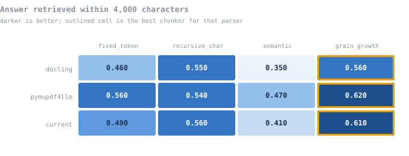

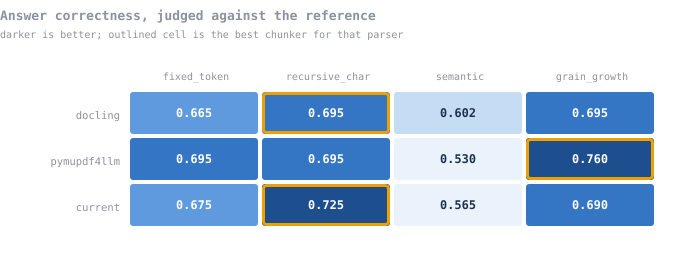

### Finding 1: a fixed k flatters large chunks

At k=5 semantic chunking looks competitive or better. At an equal 4,000-character budget it falls to last on every parser. Its retrieval score drops by 23 points between the two views on average, against 6 for Grain-Growth, because its chunks are about twice as large: it hands the model 13,208 characters of context per question against 6,952. Reporting only recall@k, as most RAG evaluations do, would have ranked the worst chunker near the top.

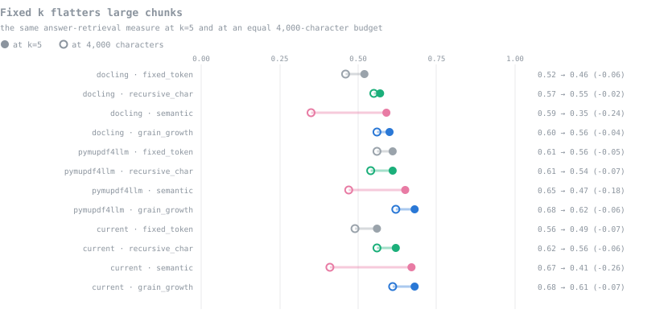

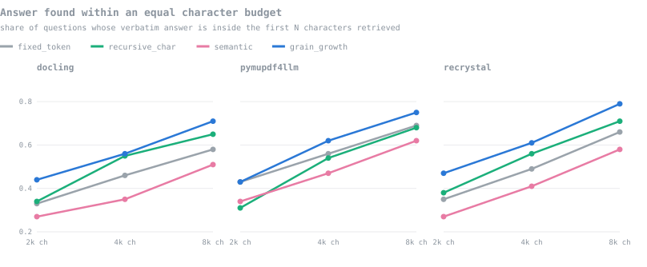

The larger context does not help the answer either. Semantic cells have the lowest faithfulness and correctness of any chunker on every parser: more text reaches the model, and more of it is irrelevant.

### Finding 2: Grain-Growth against the other chunkers

Every cell answers the same questions, so each comparison is **paired**: the table counts the questions where Grain-Growth did better (W) and worse (L), and tests the split with an exact sign test. Nine comparisons per metric is a family of tests, so significance is judged after Holm correction.

| Parser | Grain-Growth vs | Span@4k W / L | p | Holm | Correct W / L | p | Holm |
|---|---|---|---|---|---|---|---|
| `oss_docling` | `fixed_token` | 17 / 7 | 0.064 | no | 15 / 12 | 0.701 | no |
| `oss_docling` | `recursive_char` | 9 / 8 | 1.000 | no | 19 / 22 | 0.755 | no |
| `oss_docling` | `semantic` | 27 / 6 | <0.001 | yes | 25 / 15 | 0.154 | no |
| `oss_pymupdf4llm` | `fixed_token` | 21 / 15 | 0.405 | no | 24 / 14 | 0.143 | no |
| `oss_pymupdf4llm` | `recursive_char` | 18 / 10 | 0.185 | no | 16 / 8 | 0.152 | no |
| `oss_pymupdf4llm` | `semantic` | 25 / 10 | 0.017 | no | 34 / 6 | <0.001 | yes |
| `current` | `fixed_token` | 23 / 11 | 0.058 | no | 21 / 18 | 0.749 | no |
| `current` | `recursive_char` | 11 / 6 | 0.332 | no | 13 / 19 | 0.377 | no |
| `current` | `semantic` | 31 / 11 | 0.003 | yes | 29 / 12 | 0.012 | no |

**Against semantic the result is real.** Grain-Growth retrieves better on 2 of 3 parsers and answers better on 1 of 3, after correction.

**Against the simple splitters it is not established.** Grain-Growth is ahead on retrieval in 6 of 6 comparisons, and none of them survives correction; on correctness 0 of 6 survive. Many questions are answered equally well by every chunker, which leaves few discordant pairs to decide the test. The honest reading is *consistent direction, insufficient evidence*, not a win.

95% bootstrap intervals for the Grain-Growth cells show why:

| Parser | Span@4k | Correctness | Faithfulness |
|---|---|---|---|
| `oss_docling` | 0.56 [0.46, 0.66] | 0.69 [0.61, 0.78] | 0.79 [0.71, 0.86] |
| `oss_pymupdf4llm` | 0.62 [0.53, 0.71] | 0.76 [0.68, 0.84] | 0.84 [0.78, 0.91] |
| `current` | 0.61 [0.51, 0.71] | 0.69 [0.61, 0.77] | 0.81 [0.74, 0.88] |

With 100 questions an interval is about ±10 points wide, which is larger than most gaps between the three non-semantic chunkers.

### Finding 3: questions favour the parser they were written from, but only one of them

Each Grain-Growth cell, scored separately on the questions each parser's output produced (answer in the top five):

| Questions written from | n | `oss_docling` | `oss_pymupdf4llm` | `current` |
|---|---|---|---|---|
| `oss_docling` | 30 | **56.7%** | 63.3% | 56.7% |
| `oss_pymupdf4llm` | 33 | 57.6% | **63.6%** | 57.6% |
| `current` | 37 | 64.9% | 75.7% | **86.5%** |

The bold diagonal is each parser on its own questions. `current` averages +20 points on its own questions across its four cells; `oss_docling` -4, `oss_pymupdf4llm` -5. The 33/34/33 split was supposed to make the home advantage symmetric so it cancels between parsers. It did not cancel, because the advantage is concentrated in `current`.

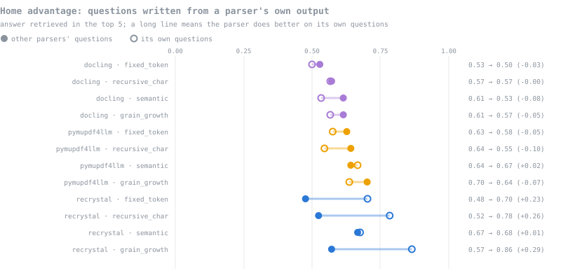

The cause is not confirmed. A plausible one: a question written from an assembled paragraph copies its answer span from that paragraph, and a parser whose chunks keep the same paragraph whole will contain the span intact, while another parser's different paragraph boundaries split it. Whatever the mechanism, **any parser ranking that uses all questions is biased**, and the next finding removes it.

### Finding 4: on neutral questions the parsers are level

For each pair of parsers, the comparison is repeated on only the third parser's questions, where neither side has a home advantage. Grain-Growth chunking throughout; Holm correction across the neutral tests.

| Pair | Metric | All questions W / L, p | Neutral questions | n | W / L | p | Holm |
|---|---|---|---|---|---|---|---|
| `current` vs `oss_docling` | span_hit@4000ch | 11 / 6, 0.332 | from `oss_pymupdf4llm` | 33 | 3 / 3 | 1.000 | no |
| `current` vs `oss_docling` | correctness | 14 / 13, 1.000 | from `oss_pymupdf4llm` | 33 | 3 / 5 | 0.727 | no |
| `current` vs `oss_pymupdf4llm` | span_hit@4000ch | 12 / 13, 1.000 | from `oss_docling` | 30 | 3 / 6 | 0.508 | no |
| `current` vs `oss_pymupdf4llm` | correctness | 5 / 15, 0.041 | from `oss_docling` | 30 | 2 / 1 | 1.000 | no |
| `oss_pymupdf4llm` vs `oss_docling` | span_hit@4000ch | 12 / 6, 0.238 | from `current` | 37 | 5 / 0 | 0.062 | no |
| `oss_pymupdf4llm` vs `oss_docling` | correctness | 19 / 10, 0.136 | from `current` | 37 | 6 / 1 | 0.125 | no |

**0 of 6 neutral comparisons are significant.** The one nominal difference on all questions, `current` against `oss_pymupdf4llm` on correctness (5 / 15, p=0.041), disappears on neutral questions (2 / 1). Neutral subsets are small, about thirty questions, so this is absence of evidence rather than evidence of equality: a real difference of a few points would not be detected. Retrieval quality does not justify choosing one parser over another.

### Finding 5: parse losses are real, but smaller than an exact match suggests

An answer span missing from a parser's output caps every chunker behind it. Counting those losses needs care, because the spans were verified against PyMuPDF text and **two of the three parsers read their words through PyMuPDF**: `current` fills YOLO boxes with `page.get_text("words")`, and PyMuPDF4LLM is built on it. Docling uses its own text engine. An exact match therefore counts Docling's differences in maths symbols, spacing and stray line numbers as lost text, even where it extracted the passage. A near match, a span-length window holding at least 90% of the span's words, tolerates those differences and still rejects a passage that is really missing.

| Parser | Text engine | exact | >= 95% of words | >= 90% of words | >= 80% of words | Really missing, retrieved anyway |
|---|---|---|---|---|---|---|
| `oss_docling` | Docling | 10 | 7 | **5** | 1 | 0 |
| `oss_pymupdf4llm` | PyMuPDF | 6 | 3 | **3** | 2 | 0 |
| `current` | PyMuPDF | 2 | 2 | **1** | 0 | 0 |

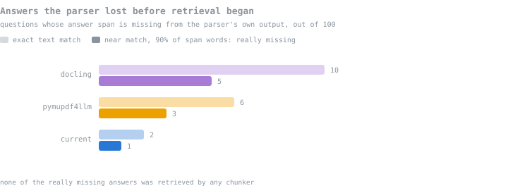

Half the gap was the engine. Docling's exact-match losses fall from 10 to 5 at the 90% threshold. `current` loses the fewest answers at every threshold, so the ordering survives the correction, but the margin is a handful of questions out of 100, not a decisive difference. No really-missing answer was retrieved by any chunker in any cell: a parse loss is unrecoverable downstream.

**The same effect reaches the retrieval metrics.** Every span-hit figure in this report, including MRR and nDCG, uses the exact match, so Docling's retrieval scores carry the same penalty and are probably understated in every cell. The run did not save the text of retrieved chunks, so they cannot be re-scored without re-running retrieval; that needs no answer generation or judging, only re-indexing. This strengthens rather than weakens Finding 4: Docling was level with the others despite the handicap.

### Finding 6: does fragmentation predict retrieval?

This is the question the whole shape evaluation rests on. Each cell's shape metrics from the 15-paper run are ranked against its retrieval scores from the 103-paper run.

| Shape metric | Retrieval metric | Spearman ρ, all cells | ρ, semantic excluded |
|---|---|---|---|
| chunks starting mid-sentence | span_hit@4000ch | +0.15 (n=12) | -0.80 (n=9) |
| chunks starting mid-sentence | span_hit@5 | -0.53 (n=12) | -0.66 (n=9) |
| chunks starting mid-sentence | correctness | +0.37 (n=12) | -0.53 (n=9) |
| chunks ending mid-sentence | span_hit@4000ch | +0.26 (n=12) | -0.64 (n=9) |
| chunks ending mid-sentence | span_hit@5 | -0.44 (n=12) | -0.52 (n=9) |
| chunks ending mid-sentence | correctness | +0.40 (n=12) | -0.39 (n=9) |
| median chunk size | span_hit@4000ch | -0.45 (n=12) | +0.10 (n=9) |
| median chunk size | span_hit@5 | +0.27 (n=12) | +0.27 (n=9) |
| median chunk size | correctness | -0.36 (n=12) | +0.55 (n=9) |
| adjacent pairs sharing no text | span_hit@4000ch | +0.17 (n=12) | +0.75 (n=9) |
| adjacent pairs sharing no text | span_hit@5 | +0.72 (n=12) | +0.66 (n=9) |
| adjacent pairs sharing no text | correctness | -0.16 (n=12) | +0.50 (n=9) |

**Across all twelve cells, fragmentation does not predict retrieval:** chunks starting mid-sentence against answer retrieval gives ρ = +0.15. **Remove the semantic cells and it does, strongly:** ρ = -0.80, fewer fragments and better retrieval. Semantic chunking is the counterexample that hides the relationship: it has almost no fragments, because it only cuts between sentences, and still retrieves worst, because its chunks are too large.

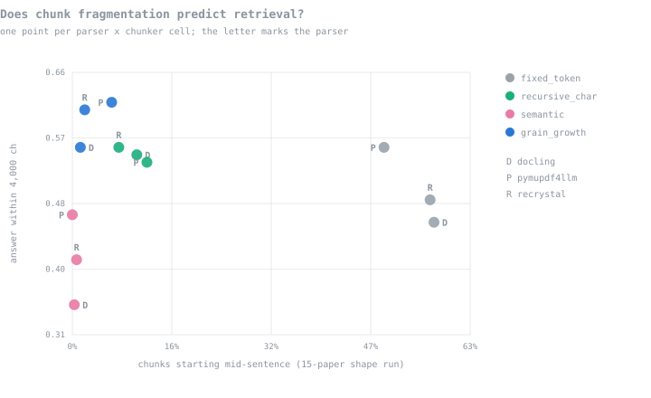

So the answer to the reviewer's question is conditional. **Fragmentation predicts retrieval among chunkers that keep chunks within a sensible size, and chunk size is the confounder that breaks it.** A shape metric on its own is not a safe proxy; paired with a size bound it is a useful one. The caveats are real: nine points, shape measured on a different and smaller corpus, and no single pairwise gap among those nine is significant on its own (Finding 2).

### Cost of the run

| Chunker | Mean minutes per cell | Mean context per question |
|---|---|---|
| `fixed_token` | 80 | 6,947 ch |
| `recursive_char` | 90 | 7,220 ch |
| `semantic` | 195 | 13,208 ch |
| `grain_growth` | 89 | 6,952 ch |

Semantic cells took about 2.2x as long as Grain-Growth: embedding every sentence to find breakpoints dominates indexing, and the larger contexts slow generation. The worst-performing chunker was also the most expensive.

### Limitations

- **Sample size.** 100 questions over 103 papers gives intervals of roughly ±10 points. Gaps smaller than that are not findings.
- **Self-judging.** The answering model and the judge are the same model, so correctness and faithfulness may favour its own phrasing. They are consistent with the judge-free span metrics in direction, which is some reassurance.
- **Question bias.** Questions were written by the same small model from one parser's output, which introduced the home advantage in Finding 3. Neutral-subset analysis removes it at the cost of sample size.
- **Corpus.** 103 papers rather than the planned 201, after arXiv rate-limited the build. A larger corpus would make paper-level retrieval harder and stop those metrics saturating.
- **Text-engine bias.** Answer spans were verified against PyMuPDF, the engine behind `current` and PyMuPDF4LLM, and span hits use an exact match. Docling is scored down for character-level differences (Finding 5). The next run should verify against a third engine and score with a near match.
- **Two runs, two corpora.** Shape metrics come from the smaller corpus, so Finding 6 correlates measurements taken on different papers.

## Recommendation

### Chunking: keep Grain-Growth

- **It is clearly better than semantic chunking**, the other strategy that respects sentence boundaries, on retrieval and on answers, and at a fraction of the cost.
- **It is not proven better than the simple splitters on retrieval.** The direction favours it and the shape evidence is strong, but a retrieval win over `recursive_char` is not established.
- **Its remaining case rests on what the span metrics do not score:** tables and formulas that never split, heading paths that make a citation readable, and chunks that stay inside the embedder's window by construction.

### Parsing: keep `current`, for fidelity and speed, not retrieval

- **Retrieval does not separate the parsers** once question bias is removed (Finding 4).
- **It loses the fewest answers before retrieval:** `oss_docling` 5, `oss_pymupdf4llm` 3, `current` 1, allowing for text-engine differences (Finding 5). The margin is small.
- **It is 2.81x faster than Docling and lighter on VRAM**, and it recovers `title` and `authors`, which Docling does not deliver.

### The strongest argument against it

**On retrieval evidence alone, neither the fine-tuned layout model nor structure-aware chunking is justified.** `recursive_char`, a character splitter any library ships, reaches 0.56 span retrieval and 0.725 correctness on `current`, against Grain-Growth's 0.61 and 0.690, and the difference is not significant. Docling and PyMuPDF4LLM, which need no training data at all, retrieve as well as our parser on neutral questions. If the only goal were getting the right passage in front of the model on arXiv preprints, the simplest stack would do.

The case for the current stack is therefore a case about **fidelity rather than ranking**: fewer answers lost in parsing, tables and formulas kept whole, readable citations, a 4 GB card shared without contention. Those are real, but they are arguments the next evaluation should measure directly, with harder corpora such as published journal PDFs with running heads, table-heavy papers and questions that need a table or an equation to answer, where fidelity should start to show up in retrieval scores rather than only in chunk shape.

## Reproducing

```bash
python evals/scripts/build_corpus.py          # or --offline to manifest a cached corpus
python evals/scripts/run_matrix.py            # chunk-shape run, checkpointed per cell
python evals/scripts/parser_quality_probe.py
python evals/scripts/parse_cache.py           # retrieval run: parse once per parser
python evals/scripts/build_questions.py       # question set, verified and shortlisted
python evals/scripts/run_rag_eval.py --device cuda 2>&1 | tee evals/Reports/rag_run.log
python evals/scripts/eval_status.py evals/Reports/rag_run.log
python evals/scripts/make_figures.py
python evals/scripts/make_main_report.py
```
