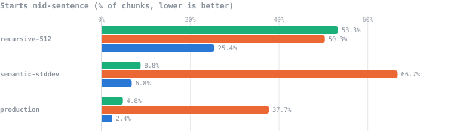
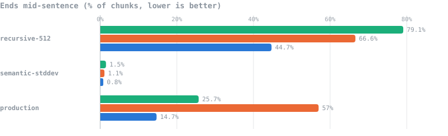
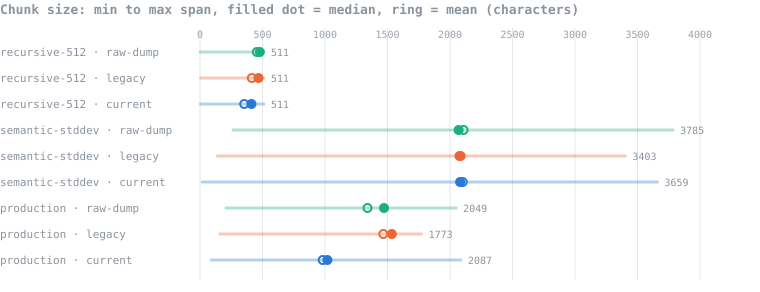
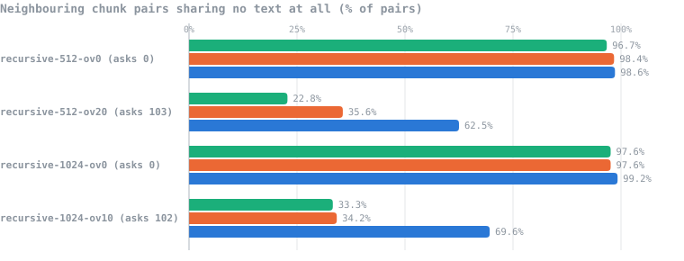

# Chunking evaluation — parsers and chunking strategies compared

Two benchmark runs over the **same twelve research papers**, measuring the
shape of what each combination of parser and chunking strategy produces.
Everything here is generated from the raw results by
[`build_report.py`](build_report.py); no number is typed by hand.

| | Run 1 | Run 2 |
|---|---|---|
| Parsers | legacy, current | **raw-dump**, legacy, current |
| Chunking variations | 10 | **11** (adds `production-as-shipped`) |
| Configurations measured | 20 | **33** |
| Papers | 12 | 12 |
| Pages | 298 | 298 |
| Seed | 20260911 | 20260911 |

Both runs used seed `20260911`, so they drew the **same twelve PDFs** from
the same 1128-file corpus. Run 2 is therefore a superset of run 1 rather than a
fresh sample, and rows shared between them are identical.

Source: [`scripts/chunking_bench.py`](../../scripts/chunking_bench.py).
Sandboxed — it reads PDFs from the external drive and writes only to its own
scratch directory, never touching `data/`, the registry or the vector store.

---

## Why there were two runs

Run 1 compared the pipeline as it stood at commit `3a577c0` against today's.
The legacy arm was a verbatim port, which meant carrying its regex paragraph
builder — a processing step with quirks of its own, including a running-header
pattern hardcoded to one specific paper.

That made the baseline ambiguous: a poor result could be blamed on the plain
text extraction or on the cleanup layered over it. **Run 2 resolves it** by
adding a third arm that extracts page text and adds nothing at all, and by
recording the shipped production configuration as its own row rather than
inferring it from a parameterised one.

The answer turned out to matter. See [Finding 1](#1-the-legacy-cleanup-step-was-the-worst-thing-in-the-legacy-pipeline).

---

## What was compared

### Parsers

| Arm | Pages | Corpus | Parse time | What it does |
|---|---|---|---|---|
| `raw-dump` | 298 | 1.08 MB | 1.3s | PyMuPDF `page.get_text()`, nothing added |
| `legacy` | 298 | 0.95 MB | 1.3s | page dump, then the `3a577c0` regex paragraph rules |
| `current` | 298 | 0.99 MB | 25.1s | YOLOv11 layout detection, then typed blocks |

All three reached **every one of the 298 pages** and produced
comparable text volume, so differences below come from structure, not from one arm
having more to work with.

### Chunking strategies

| Strategy | Variations swept | Knob unique to it |
|---|---|---|
| `recursive` | 512 and 1024 chars × 0 / 10 / 20% overlap | size and overlap |
| `semantic` | percentile, standard deviation, interquartile | **the breakpoint threshold type** |
| `structure` | target 1500 and 2000, heading prefix on and off | **the heading-path prefix** |
| `production` | none — `chunk_document`'s own defaults | the shipped configuration, verbatim |

`recursive` and `semantic` consume flat text and run on all three parsers.
`structure` and `production` consume blocks; on `raw-dump` those blocks are whole
pages and on `legacy` they are regex paragraphs, which is itself part of the result.

---

## Metrics, and where each one is

Every parameter is measured for **every** configuration and appears on one row in
[the full table](#full-results-every-configuration-every-metric) and in
[`data/combined_metrics.csv`](data/combined_metrics.csv).

| Requested | Column | How it is derived |
|---|---|---|
| Total pages | `Pages` | pages the parser actually read |
| Total corpus size | `Corpus` | bytes of extracted text, UTF-8 |
| Chunks | `Chunks` | count across all 12 papers |
| Average chunk size | `Avg` | mean characters |
| Median chunk size | `Median` | median characters |
| Minimum chunk size | `Min` | smallest chunk produced |
| Maximum chunk size | `Max` | largest chunk produced |
| Overlap 0 | `Ov=0` | share of neighbouring pairs sharing **no** text |
| Overlap n | `Ov med`, `Ov max` | median and maximum shared characters where they do overlap |
| Starts mid-sentence | `Mid-start` | chunk body begins lowercase or with continuation punctuation |
| Ends mid-sentence | `Mid-end` | chunk body ends without terminal punctuation |

Overlap is **measured from the chunk text**, not read from the configuration, by
finding the longest suffix of one chunk that is a prefix of the next. That makes
strategies which never declare an overlap directly comparable with those that do —
and reveals that a declared overlap is only an upper bound
([Finding 4](#4-declared-overlap-is-not-achieved-overlap)).

For `Mid-start` the heading prefix is stripped before judging, so the structure
arm is not credited for text the chunker adds.

---

## Visuals

`■` <span style="color:#1baf7a">raw-dump</span> · `■` <span style="color:#eb6834">legacy</span> · `■` <span style="color:#2a78d6">current</span>

### Fragment rates





A chunk that begins mid-sentence was cut out of the middle of a thought; one that
ends without punctuation was cut off before the end of one. Both hurt embedding
quality and make a citation unreadable.

### Chunk size distribution



The span runs from the smallest chunk to the largest; the filled dot is the median
and the ring is the mean. Where the two markers separate, the distribution is
skewed — `semantic` on every arm has a long tail of very large chunks.

### Overlap actually achieved



Each bar is the share of neighbouring pairs sharing no text at all. The variations
that *ask* for overlap still leave a third to a quarter of their boundaries with
none.

---

## Findings

### 1. The legacy cleanup step was the worst thing in the legacy pipeline

Strip the regex paragraph builder and keep only the raw dump:

| Strategy | raw-dump | legacy | change |
|---|---|---|---|
| `semantic-stddev` | **8.8%** | 66.7% | −57.9 points |
| `production` | **4.8%** | 37.7% | −32.9 points |

Its break rules fire on any line under ten words, which in a two-column paper is
most lines, so it shredded prose into fragments no downstream chunker could rejoin.
**Doing nothing produced a better baseline than the cleanup meant to improve it.**

This inverts the run 1 conclusion: the gap between legacy and current was
substantially a bad processing step, not layout detection alone.

### 2. The parser still decides fragment rate

Against the stronger `raw-dump` baseline, at the shipped settings:

| Metric | raw-dump | current |
|---|---|---|
| Starts mid-sentence | 4.8% | **2.4%** |
| Ends mid-sentence | 25.7% | **14.7%** |

Smaller than run 1 suggested, but consistent, and on the same pages with comparable
text volume.

### 3. A page dump keeps sentences whole and paragraphs broken

`raw-dump` is the **worst** arm in the entire evaluation on `Mid-end` for recursive
chunking (80.2% at
1024 characters) and among the best on `Mid-start`. Nothing cuts its sentences, but
its only unit is the page, so a chunk ends wherever the page did. It needs a
structure-respecting chunker to look good at all.

### 4. Declared overlap is not achieved overlap

`recursive-512-ov20` requests 103 characters:

| Arm | Pairs with no overlap | Median overlap | Max overlap |
|---|---|---|---|
| raw-dump | 22.8% | 81 | 102 |
| legacy | 35.6% | 65 | 182 |
| current | 62.5% | 98 | 102 |

The splitter abandons overlap whenever it breaks on a separator, so the configured
number is a ceiling rather than a setting.

### 5. Semantic chunking hides bad parsing rather than fixing it

Its `Mid-end` is near zero on every arm (0.8% to
1.5%) because it cuts on
sentence boundaries by construction. But on legacy text its `Mid-start` is the worst
figure in the whole evaluation at
66.7%. It repairs the metric
you would think to check and leaves the damage untouched.

### 6. Among semantic thresholds, only percentile differs meaningfully

Standard deviation and interquartile land within
0
chunks of each other on current text and produce near-identical distributions.
Percentile is far more aggressive:
785 chunks against
488.

### 7. The heading prefix earns its place

Removing it — the knob unique to structure chunking — costs
125
characters of median size and raises `Mid-start` from
2.4% to
3.7%. It is also
what pushes measured overlap to
228 characters, because
consecutive chunks in a section share the same heading text.

### 8. The shipped configuration is the one being measured

`production-as-shipped` calls `chunk_document` with nothing overridden. It
reproduces the `structure-1500` row exactly on all three arms, confirming the
benchmark tests what actually runs rather than a lookalike.

### 9. Layout parsing costs 19× more time and it does not matter

1.3s against 25.1s for
298 pages. At roughly 12 pages a second the whole 48-paper
corpus parses in minutes, which is irrelevant beside a one-off ingest that also has
to embed everything.

---

## Full results: every configuration, every metric

Run 2, all 33 configurations. `Ov=0` is the
share of neighbouring pairs sharing no text; `Ov med` and `Ov max` are the shared
characters where they do overlap.

| Parser | Strategy | Variation | Pages | Corpus | Chunks | Avg | Median | Min | Max | Ov=0 | Ov med | Ov max | Mid-start | Mid-end |
|---|---|---|---|---|---|---|---|---|---|---|---|---|---|---|
| raw-dump | recursive | `recursive-512-ov0` | 298 | 1.08 MB | 2466 | 454 | 478 | 1 | 511 | 96.7% | 1 | 32 | 53.3% | 79.1% |
| raw-dump | recursive | `recursive-512-ov20` | 298 | 1.08 MB | 2797 | 459 | 478 | 15 | 511 | 22.8% | 81 | 102 | 57.6% | 79.5% |
| raw-dump | recursive | `recursive-1024-ov0` | 298 | 1.08 MB | 1277 | 878 | 983 | 2 | 1023 | 97.6% | 1 | 17 | 48.8% | 80.2% |
| raw-dump | recursive | `recursive-1024-ov10` | 298 | 1.08 MB | 1328 | 894 | 985 | 38 | 1023 | 33.3% | 75 | 101 | 51.9% | 80.7% |
| raw-dump | semantic | `semantic-percentile` | 298 | 1.08 MB | 843 | 1330 | 1537 | 2 | 3667 | 100.0% | 0 | 0 | 5.6% | 0.9% |
| raw-dump | semantic | `semantic-stddev` | 298 | 1.08 MB | 532 | 2109 | 2069 | 265 | 3785 | 99.4% | 2 | 8 | 8.8% | 1.5% |
| raw-dump | semantic | `semantic-interquartile` | 298 | 1.08 MB | 534 | 2101 | 2068 | 265 | 3785 | 99.4% | 2 | 8 | 8.8% | 1.5% |
| raw-dump | structure | `structure-1500` | 298 | 1.08 MB | 964 | 1340 | 1472 | 206 | 2049 | 99.8% | 4 | 8 | 4.8% | 25.7% |
| raw-dump | structure | `structure-2000` | 298 | 1.08 MB | 706 | 1755 | 1956 | 295 | 2731 | 99.6% | 8 | 312 | 6.5% | 33.0% |
| raw-dump | structure | `structure-1500-noheading` | 298 | 1.08 MB | 964 | 1255 | 1386 | 132 | 1954 | 32.2% | 127 | 486 | 5.0% | 25.7% |
| raw-dump | production | `production-as-shipped` | 298 | 1.08 MB | 964 | 1340 | 1472 | 206 | 2049 | 99.8% | 4 | 8 | 4.8% | 25.7% |
| legacy | recursive | `recursive-512-ov0` | 298 | 0.95 MB | 2382 | 414 | 468 | 5 | 511 | 98.4% | 1 | 90 | 50.3% | 66.6% |
| legacy | recursive | `recursive-512-ov20` | 298 | 0.95 MB | 2603 | 426 | 471 | 22 | 511 | 35.6% | 65 | 182 | 47.5% | 67.5% |
| legacy | recursive | `recursive-1024-ov0` | 298 | 0.95 MB | 1108 | 892 | 972 | 5 | 1023 | 97.6% | 1 | 99 | 49.9% | 60.2% |
| legacy | recursive | `recursive-1024-ov10` | 298 | 0.95 MB | 1156 | 900 | 976 | 38 | 1023 | 34.2% | 59 | 101 | 43.4% | 61.2% |
| legacy | semantic | `semantic-percentile` | 298 | 0.95 MB | 748 | 1321 | 1528 | 2 | 3105 | 99.9% | 1 | 1 | 57.6% | 0.7% |
| legacy | semantic | `semantic-stddev` | 298 | 0.95 MB | 474 | 2086 | 2076 | 139 | 3403 | 99.8% | 1 | 1 | 66.7% | 1.1% |
| legacy | semantic | `semantic-interquartile` | 298 | 0.95 MB | 476 | 2077 | 2077 | 139 | 3403 | 99.8% | 1 | 1 | 65.8% | 1.1% |
| legacy | structure | `structure-1500` | 298 | 0.95 MB | 717 | 1466 | 1534 | 159 | 1773 | 99.6% | 9 | 13 | 37.7% | 57.0% |
| legacy | structure | `structure-2000` | 298 | 0.95 MB | 532 | 1947 | 2035 | 193 | 2101 | 99.6% | 5 | 9 | 38.2% | 62.2% |
| legacy | structure | `structure-1500-noheading` | 298 | 0.95 MB | 717 | 1380 | 1453 | 57 | 1690 | 97.9% | 1 | 90 | 46.4% | 57.0% |
| legacy | production | `production-as-shipped` | 298 | 0.95 MB | 717 | 1466 | 1534 | 159 | 1773 | 99.6% | 9 | 13 | 37.7% | 57.0% |
| current | recursive | `recursive-512-ov0` | 298 | 0.99 MB | 2889 | 354 | 411 | 5 | 511 | 98.6% | 1 | 26 | 25.4% | 44.7% |
| current | recursive | `recursive-512-ov20` | 298 | 0.99 MB | 3018 | 373 | 424 | 10 | 511 | 62.5% | 98 | 102 | 26.2% | 46.5% |
| current | recursive | `recursive-1024-ov0` | 298 | 0.99 MB | 1431 | 716 | 812 | 7 | 1023 | 99.2% | 1 | 26 | 12.4% | 35.6% |
| current | recursive | `recursive-1024-ov10` | 298 | 0.99 MB | 1447 | 729 | 819 | 10 | 1023 | 69.6% | 72 | 101 | 12.0% | 35.5% |
| current | semantic | `semantic-percentile` | 298 | 0.99 MB | 785 | 1306 | 1464 | 2 | 3659 | 99.7% | 4 | 8 | 4.1% | 0.5% |
| current | semantic | `semantic-stddev` | 298 | 0.99 MB | 488 | 2102 | 2081 | 18 | 3659 | 99.6% | 1 | 2 | 6.8% | 0.8% |
| current | semantic | `semantic-interquartile` | 298 | 0.99 MB | 488 | 2102 | 2083 | 18 | 3659 | 99.6% | 1 | 2 | 6.8% | 0.8% |
| current | structure | `structure-1500` | 298 | 0.99 MB | 1167 | 981 | 1019 | 90 | 2087 | 99.7% | 1 | 8 | 2.4% | 14.7% |
| current | structure | `structure-2000` | 298 | 0.99 MB | 1020 | 1105 | 1057 | 90 | 2729 | 99.8% | 4 | 8 | 2.1% | 15.1% |
| current | structure | `structure-1500-noheading` | 298 | 0.99 MB | 1167 | 858 | 894 | 4 | 1999 | 99.2% | 110 | 228 | 3.7% | 14.7% |
| current | production | `production-as-shipped` | 298 | 0.99 MB | 1167 | 981 | 1019 | 90 | 2087 | 99.7% | 1 | 8 | 2.4% | 14.7% |

### Run 1, for comparison

Identical rows to run 2 for the shared configurations, which is the expected result
of the same seed.

| Parser | Strategy | Variation | Pages | Corpus | Chunks | Avg | Median | Min | Max | Ov=0 | Ov med | Ov max | Mid-start | Mid-end |
|---|---|---|---|---|---|---|---|---|---|---|---|---|---|---|
| legacy | recursive | `recursive-512-ov0` | 298 | 0.95 MB | 2382 | 414 | 468 | 5 | 511 | 98.4% | 1 | 90 | 50.3% | 66.6% |
| legacy | recursive | `recursive-512-ov20` | 298 | 0.95 MB | 2603 | 426 | 471 | 22 | 511 | 35.6% | 65 | 182 | 47.5% | 67.5% |
| legacy | recursive | `recursive-1024-ov0` | 298 | 0.95 MB | 1108 | 892 | 972 | 5 | 1023 | 97.6% | 1 | 99 | 49.9% | 60.2% |
| legacy | recursive | `recursive-1024-ov10` | 298 | 0.95 MB | 1156 | 900 | 976 | 38 | 1023 | 34.2% | 59 | 101 | 43.4% | 61.2% |
| legacy | semantic | `semantic-percentile` | 298 | 0.95 MB | 748 | 1321 | 1528 | 2 | 3105 | 99.9% | 1 | 1 | 57.6% | 0.7% |
| legacy | semantic | `semantic-stddev` | 298 | 0.95 MB | 474 | 2086 | 2076 | 139 | 3403 | 99.8% | 1 | 1 | 66.7% | 1.1% |
| legacy | semantic | `semantic-interquartile` | 298 | 0.95 MB | 476 | 2077 | 2077 | 139 | 3403 | 99.8% | 1 | 1 | 65.8% | 1.1% |
| legacy | structure | `structure-1500` | 298 | 0.95 MB | 717 | 1466 | 1534 | 159 | 1773 | 99.6% | 9 | 13 | 37.7% | 57.0% |
| legacy | structure | `structure-2000` | 298 | 0.95 MB | 532 | 1947 | 2035 | 193 | 2101 | 99.6% | 5 | 9 | 38.2% | 62.2% |
| legacy | structure | `structure-1500-noheading` | 298 | 0.95 MB | 717 | 1380 | 1453 | 57 | 1690 | 97.9% | 1 | 90 | 46.4% | 57.0% |
| current | recursive | `recursive-512-ov0` | 298 | 0.99 MB | 2889 | 354 | 411 | 5 | 511 | 98.6% | 1 | 26 | 25.4% | 44.7% |
| current | recursive | `recursive-512-ov20` | 298 | 0.99 MB | 3018 | 373 | 424 | 10 | 511 | 62.5% | 98 | 102 | 26.2% | 46.5% |
| current | recursive | `recursive-1024-ov0` | 298 | 0.99 MB | 1431 | 716 | 812 | 7 | 1023 | 99.2% | 1 | 26 | 12.4% | 35.6% |
| current | recursive | `recursive-1024-ov10` | 298 | 0.99 MB | 1447 | 729 | 819 | 10 | 1023 | 69.6% | 72 | 101 | 12.0% | 35.5% |
| current | semantic | `semantic-percentile` | 298 | 0.99 MB | 785 | 1306 | 1464 | 2 | 3659 | 99.7% | 4 | 8 | 4.1% | 0.5% |
| current | semantic | `semantic-stddev` | 298 | 0.99 MB | 488 | 2102 | 2081 | 18 | 3659 | 99.6% | 1 | 2 | 6.8% | 0.8% |
| current | semantic | `semantic-interquartile` | 298 | 0.99 MB | 488 | 2102 | 2083 | 18 | 3659 | 99.6% | 1 | 2 | 6.8% | 0.8% |
| current | structure | `structure-1500` | 298 | 0.99 MB | 1167 | 981 | 1019 | 90 | 2087 | 99.7% | 1 | 8 | 2.4% | 14.7% |
| current | structure | `structure-2000` | 298 | 0.99 MB | 1020 | 1105 | 1057 | 90 | 2729 | 99.8% | 4 | 8 | 2.1% | 15.1% |
| current | structure | `structure-1500-noheading` | 298 | 0.99 MB | 1167 | 858 | 894 | 4 | 1999 | 99.2% | 110 | 228 | 3.7% | 14.7% |

---

## What this does not measure

Every number here describes the **shape** of the output. None of it says whether a
question gets a better answer. Chunk shape is necessary but not sufficient: a corpus
of clean, well-formed chunks can still retrieve the wrong passage.

Retrieval quality is measured separately by
[`scripts/retrieval_eval.py`](../../scripts/retrieval_eval.py) against a generated
and verified question set. Its pilot of 24 questions could not separate the
pipelines at a 95% margin of error of ±20 points, and needs a full-corpus run before
it says anything.

Twelve papers is a sample. The fragment-rate gaps are far too large for sampling
noise to explain, but the exact percentages will move on a different draw. The seed
is recorded so both runs reproduce exactly.

---

## Files

| Path | What it is |
|---|---|
| [`README.md`](README.md) | this document |
| [`build_report.py`](build_report.py) | regenerates everything from the raw results |
| [`data/run1.json`](data/run1.json) | run 1 results, verbatim |
| [`data/run2.json`](data/run2.json) | run 2 results, verbatim |
| [`data/combined_metrics.csv`](data/combined_metrics.csv) | both runs, every configuration, every metric |
| `figures/*.svg` | the visuals above |

Per-paper parsed JSON and the full chunk lists for every variation stay in the
benchmark's scratch directories, `/tmp/chunking_bench` and
`/tmp/chunking_bench_v2`, at about 12 MB per arm.

Reproduce:

```bash
python scripts/chunking_bench.py --n 12 --seed 20260911
BENCH_DIR=/tmp/chunking_bench_v2 python scripts/chunking_bench.py --n 12 --seed 20260911
python evals/chunking_eval/build_report.py
```
